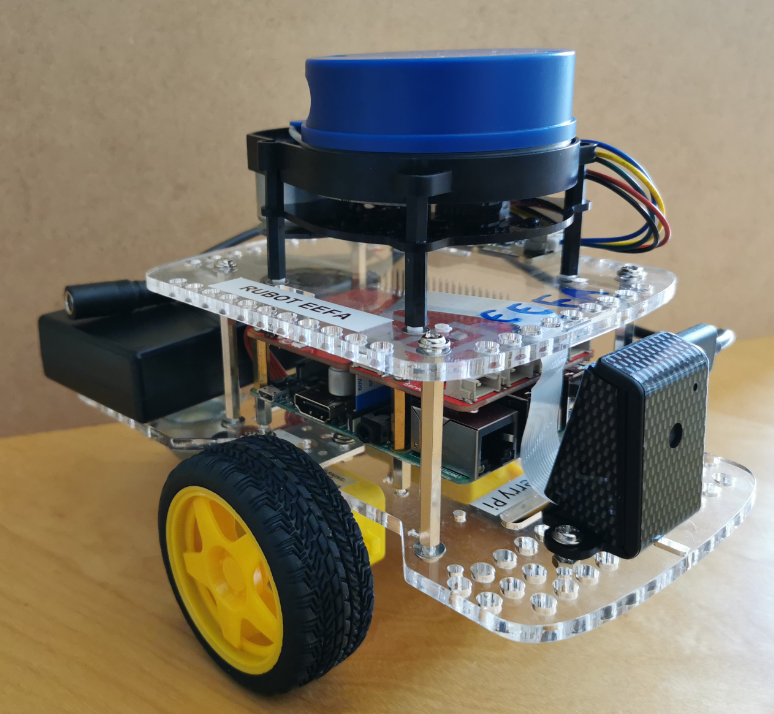

# **gopigo3 setup**

Gopigo3 robot prototype is based on:
- On-board computer based on raspberrypi4 board
- 2 DC-motor with encoder for differential drive controller
- RaspiCAM RGB camera
- LIDAR sensor



The main objectives of this chapter are:
- Getting started with gopigo in simulation environment
- Getting started with gopigo in real raspberrypi4 based robot

## **1. Getting started with gopigo in simulation environment**

To setup the repository in your ROS environment, you need to:

- Fork my repository (https://github.com/manelpuig/rUBot_gopigo_ws) in your github account
- Open your ROS Noetic environment: https://app.theconstructsim.com/
- Clone your forked directory in your home directory

```shell
cd /home/user
git clone https://github.com/your_username/rUBot_gopigo_ws
cd rUBot_gopigo_ws
catkin_make
```
- Open .bashrc file with VS Code (open file...)
- Ensure that you have the last 2 lines (review the exact name of your repository):

```shell
source /opt/ros/noetic/setup.bash
source /home/user/rUBot_gopigo_ws/devel/setup.bash
```
You are ready to work with your repository!

### **gopigo bringup**

Now you can bringup our robot:
- launch the gopigo3 node: able to control de 2 motors and measure the odometry
- launch the raspicam node
- launch the LIDAR sensor node

A launch file is made to automatically make the bringup hardware:
```shell
roslaunch gopigo3_description gopigo3_bringup_sw.launch
```
> Specify in launch file the final urdf file model


## **2. Getting started with gopigo in real raspberrypi4 based robot**

The raspberrypi4 onboard is preinstalled with:
- Ubuntu20.04
- ROS1 Noetic

When connected to power, it is configured to:
- generate a hotspot "rubot_XX"
- virtual monitor installed
- LIDAR activated 
- raspicam activated 

### **Robot connection from PC**

To connect your PC to the Robot, we have to:
- select the rubot hotspot:
    - SSID name: rubot_XX 
    - password "CorrePiCorre"

### **Using nomachine remote desktop**
To connect your computer to the robot using Nomachine:
- Plug the pendrive to USB port of PC in Lab IE
- Execute "nxplayer.exe" 

Add new robot and edit the connection:
- Name: rUBot_XX
- Host: 10.42.0.1
- Port: 4000
- Protocol: NX

Connect
- user: pi
- password: ubuntu0ubuntu1

For a proper Display resolution in Nomachina select: Display --> Change the size of remote screen

You will have the rUBot desktop on your windows nomachine screen

### **Clone a repository**

The first time you have to clone the "rUBot_gopigo_ws" repository to the home folder.
```shell
cd /home
git clone https://github.com/your_username/rUBot_gopigo_ws
cd rUBot_gopigo_ws
catkin_make
```
> If you have not internet connection you can copy the folder from a pendrive on the raspberrypi4 USB port

Review the ~/.bashrc: Verify the last lines:
```shell
source /opt/ros/noetic/setup.bash
source /home/rUBot_gopigo_ws/devel/setup.bash
```

### **Real HW gopigo3 bringup**

In real environment, the bringup process depends on the real robot. You will have to launch the different nodes that wakes-up the robot. 

We have created a "gopigo_bringup_hw.launch" file that contains:
- launch the gopigo node that controls the robot kinematics
- launch the LIDAR node
- launch the camera node

We have to uodate the ubuntu with the "software updater" application.

Open a terminal and type:
```shell
sudo apt update
sudo apt update
sudo apt install python3-pip
```

We have first to install some HW packages:
- **gopigo3_node**
To proper install the gopigo3 in Ubuntu20.04 within ROS Noetic, you can follow th instructions in: https://github.com/slowrunner/Focal_Noetic_Hands_On_ROS/tree/main

You have to adapt the path in the installation bash file ("home/ubuntu" instead of "home/pi"):
https://github.com/slowrunner/Focal_Noetic_Hands_On_ROS/blob/main/setup/install_gopigo3_on_ubuntu.sh

```shell
cd src
git clone https://github.com/ros-gopigo/gopigo3_node
pip install gopigo3
```

- **rpLidar**
```shell
sudo apt install ros-noetic-rplidar-ros
```
- **Raspicam**

You can install package following instructions in:https://github.com/UbiquityRobotics/raspicam_node

```shell
cd src
git clone https://github.com/UbiquityRobotics/raspicam_node
```
To bringup the gopigo3 robot, execute in a first terminal:
```shell
roslaunch gopigo3_description gopigo_bringup_hw.launch
```
- **OpenCV**
```shell
sudo apt install ros-noetic-vision-opencv
```
Now you can bringup our robot:
- launch the gopigo3 node: able to control de 2 motors and measure the odometry
- launch the raspicam node
- launch the LIDAR sensor node

A launch file is made to automatically make the bringup hardware:
```shell
roslaunch gopigo3_description gopigo3_bringup_hw.launch
```
> Specify in launch file the robot urdf file model you have used
