# **gopigo3 model & control**
The objectives of this chapter are:
- Create a model of our gopigo3 robot 
- use rviz package to view the different topics and nodes
- create a model of the virtual environment
- use gazebo package to simulate the robot kinematics and dynamics
- locate the robot in our created environment
- create our firsts programs to control the robot movement with obstacle avoidance


The final model represents the real gopigo3 robot we will use in the laboratory

Interesting complementary information could be found:

- https://brjapon.medium.com/learning-robotics-with-ros-made-easy-12197c918dab

- http://wiki.ros.org/Robots/gopigo3

- https://robots.ros.org/gopigo3/

- https://github.com/ros-gopigo3/gopigo3

- https://bitbucket.org/theconstructcore/two-wheeled-robot-motion-planning/src/master/

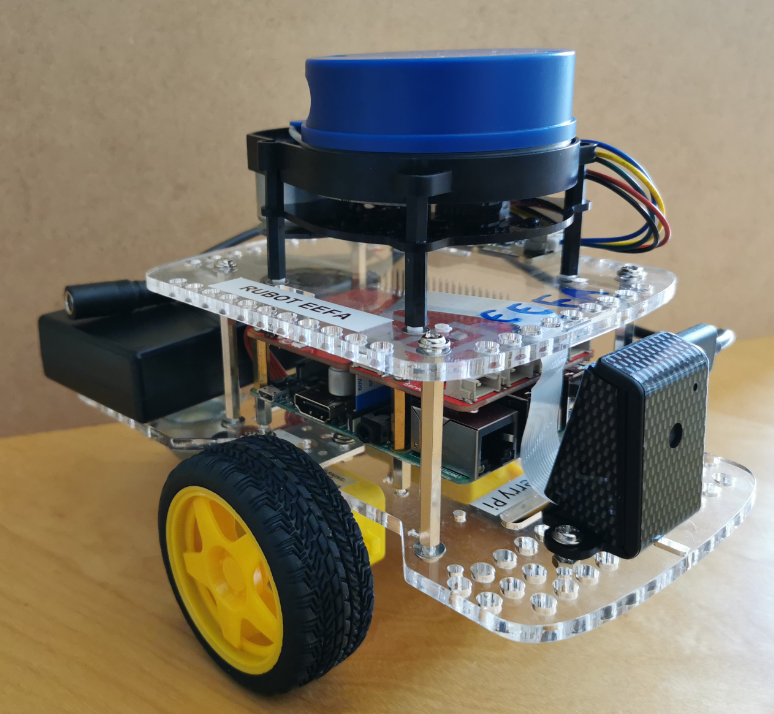

## **1. rUBot gopigo3 model generation**

We have already created the "gopigo3_description" package to generate our robot model.
We remind you the needed instructions to create the package if you want to do it from zero:
```shell
cd ~/Desktop/rUBot_gopigo_ws/src
catkin_create_pkg gopigo3_description rospy
cd ..
catkin_make
```
Then open the .bashrc file and verify the environment variables and source to the proper workspace:
```shell
source ~/Desktop/rUBot_gopigo_ws/devel/setup.bash
```
To create our robot model, we use URDF files (Unified Robot Description Format). URDF file is an XML format file for representing a robot model (http://wiki.ros.org/urdf/Tutorials).

We have created 2 folders for model description:
- URDF: folder where different URDF models are located
- meshes: folder where 3D body models in stl format are located.

You can reduce the amount of code in a URDF file using Xacro package. With this package you can use constants, simple math and macros to create your robot model easier and compact.

The main parts of URDF model are:
- links: diferent bodies/plastic elements
- joints: connection between 2 links 
- sensors & actuators plugins (2D camera, LIDAR and DC motors)

The link definition contains:
- visual properties: the origin, geometry and material
- collision properties: the origin and geomnetry
- inertial properties: the origin, mass and inertia matrix

The joint definition contains:
- joint Type (fixed, continuous)
- parent and child frames
- origin frame
- rotation axis

In the case or wright wheel:
```xml
<!-- Right Wheel -->
  <link name="right_wheel">
    <visual>
      <origin xyz="0 0 0" rpy="1.570795 0 0" />
      <geometry>
          <cylinder length="0.05" radius="0.1" />
      </geometry>
      <material name="orange"/>
    </visual>
    <collision>
      <origin xyz="0 0 0" rpy="1.570795 0 0" />
      <geometry>
          <cylinder length="0.05" radius="0.1" />
      </geometry>
    </collision>
    <inertial>
      <origin xyz="0 0 0" rpy="1.570795 0 0" />
      <mass value="0.15"/>
      <inertia ixx="0.01" ixy="0.0" ixz="0.0" iyy="0.005" iyz="0.0" izz="0.005"/>
    </inertial>
  </link>
  
  <!-- Right Wheel joint -->
  <joint name="joint_right_wheel" type="continuous">
    <parent link="base_link"/>
    <child link="right_wheel"/>
    <origin xyz="0 -0.30 0.025" rpy="0 0 0" /> 
    <axis xyz="0 1 0" />
  </joint>
```
The gopigo3 model includes different sensors and actuators:

Sensors:
- a two-dimensional camera: correspondas to RBPi camera
- a 360º LIDAR sensor: 
  - the EAI YDLIDAR X4 (https://www.robotshop.com/es/es/escaner-laser-360-ydlidar-x4.html) 
  - or RPLidar A1M8 (https://www.robotshop.com/es/es/rplidar-a1m8-kit-desarrollo-escaner-laser-360-grados.html)

Actuator:
- Differential drive actuator: based on 2 DC motors with encoders to obtain the Odometry information

The full model contains also information about the sensor and actuator controllers using specific Gazebo plugins (http://gazebosim.org/tutorials?tut=ros_gzplugins#Tutorial:UsingGazebopluginswithROS). 

Gazebo plugins give your URDF models greater functionality and compatiblility with ROS messages and service calls for sensor output and motor input. 

These plugins can be referenced through a URDF file, and to insert them in the URDF file, you have to follow the sintax:
- for Differential drive actuator:
```xml
 <!-- Differential Drive Controller -->
  <gazebo>
    <plugin filename="libgazebo_ros_diff_drive.so" name="gopigo3_controller">
      <commandTopic>cmd_vel</commandTopic>
      <odometryTopic>odom</odometryTopic>
      <odometryFrame>odom</odometryFrame>
      <odometrySource>world</odometrySource>
      <publishOdomTF>true</publishOdomTF>
      <robotBaseFrame>base_footprint</robotBaseFrame>
      <publishWheelTF>false</publishWheelTF>
      <publishTf>true</publishTf>
      <publishWheelJointState>true</publishWheelJointState>
      <legacyMode>false</legacyMode>
      <updateRate>30</updateRate>
      <leftJoint>wheel_left_joint</leftJoint>
      <rightJoint>wheel_right_joint</rightJoint>
      <wheelSeparation>0.116</wheelSeparation>
      <wheelDiameter>0.066</wheelDiameter>
      <wheelAcceleration>0.5</wheelAcceleration>
      <wheelTorque>1</wheelTorque>
      <rosDebugLevel>na</rosDebugLevel>
    </plugin>
  </gazebo>
  ```
In this gazebo plugin, the kinematics of the robot configuration is defined:
- Forward kinematics: obtaining the robot POSE (odometry) with the robot wheel speeds information
- Inverse kinematics: obtaining the robot wheels speds to reach specific robot POSE (odometry)

The equations are sumarized below
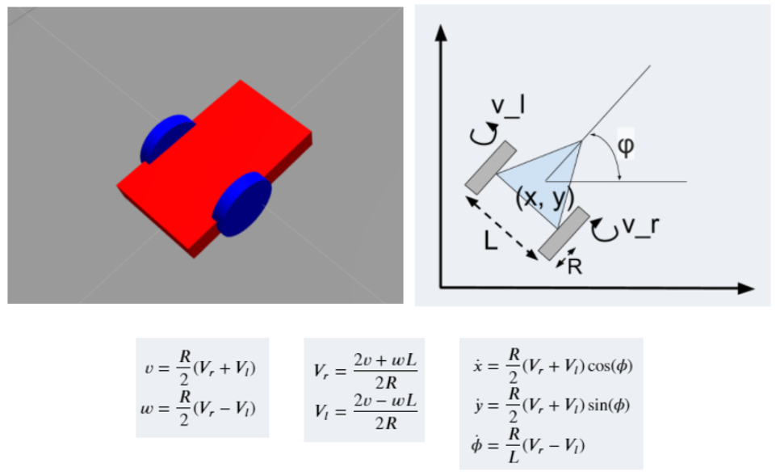
- for Raspicam sensor plugins:
```xml
  <!-- 2D Camera controller -->
  <gazebo reference="camera_rgb_frame">
    <sensor name="camera1" type="camera">
      <always_on>true</always_on>
      <visualize>false</visualize>
      <camera name="front">
        <horizontal_fov>1.3962634</horizontal_fov>
        <image>
          <width>800</width>
          <height>800</height>
          <format>R8G8B8</format>
        </image>
        <clip>
          <near>0.02</near>
          <far>300</far>
        </clip>
      </camera>
      <plugin filename="libgazebo_ros_camera.so" name="camera_controller">
        <alwaysOn>true</alwaysOn>
        <updateRate>30.0</updateRate>
        <cameraName>gopigo/camera1</cameraName>
        <imageTopicName>image_raw</imageTopicName>
        <cameraInfoTopicName>camera_info</cameraInfoTopicName>
        <frameName>camera_rgb_frame</frameName>
        <hackBaseline>0.07</hackBaseline>
        <distortionK1>0.0</distortionK1>
        <distortionK2>0.0</distortionK2>
        <distortionK3>0.0</distortionK3>
        <distortionT1>0.0</distortionT1>
        <distortionT2>0.0</distortionT2>
      </plugin>
    </sensor>
  </gazebo>
  ```
- for LIDAR sensor plugin:
```xml
  <!-- Laser Distance Sensor YDLIDAR X4 controller-->
  <gazebo reference="base_scan">
    <material>Gazebo/FlatBlack</material>
    <sensor name="lds_lfcd_sensor" type="ray">
      <pose>0 0 0 0 0 0</pose>
      <visualize>false</visualize>
      <update_rate>10</update_rate>
      <ray>
        <scan>
          <horizontal>
            <samples>720</samples>
            <resolution>1</resolution>
            <min_angle>0.0</min_angle>
            <max_angle>6.28319</max_angle>
          </horizontal>
        </scan>
        <range>
          <min>0.120</min>
          <max>10</max>
          <resolution>0.015</resolution>
        </range>
        <noise>
          <type>gaussian</type>
          <!-- Noise parameters based on published spec for YDLIDAR X4
               is 1.5% at half range 4m (= 60mm, "+-160mm" accuracy at max. range 8m).
               A mean of 0.0m and stddev of 0.020m will put 99.7% of samples
               within 0.16m of the true reading. -->
          <mean>0.0</mean>
          <stddev>0.02</stddev>
        </noise>
      </ray>
      <plugin filename="libgazebo_ros_laser.so" name="gazebo_ros_lds_lfcd_controller">
        <topicName>scan</topicName>
        <frameName>base_scan</frameName>
      </plugin>
    </sensor>
  </gazebo>
  ```
#### **Generated models in URDF**
The diferent model files we have created in urdf folder are:
- gopigo3_v1.urdf: includes only the geometrical description of gopigo robot.
- gopigo3_v2.urdf: includes sensors and actuator:
    - the 2D camera and LDS sensors
    - the differential drive actuator
- gopigo3_v3.urdf: includes sensors and actuator:
    - the 2D camera, LDS and LIDAR sensors
    - the differential drive actuator
- gopigo3_v4.gazebo: includes corrections in the proposed model:
    - base_link geometry and inertia
    - 2D camera real position
    - LIDAR scaling and orientation

We use a specific "display.launch" launch file where we specify the robot model we want to open in rviz with a configuration specified in "urdf.rviz":
```xml
<?xml version="1.0"?>
<launch>
  <!-- set these parameters on Parameter Server -->
  <param name="robot_description" textfile="$(find gopigo3_description)/urdf/gopigo3.urdf" />
  <!-- send fake joint values -->
  <node name="joint_state_publisher" pkg="joint_state_publisher" type="joint_state_publisher">
    <param name="use_gui" value="False"/>
  </node>
  <!-- Combine joint values -->
  <node name="robot_state_publisher" pkg="robot_state_publisher" type="robot_state_publisher"/>
  <!-- Show in Rviz   -->
  <node name="rviz" pkg="rviz" type="rviz" args="-d $(find gopigo3_description)/rviz/urdf.rviz"/>
</launch>
```
Launch the ROS visualization tool to check that the model is properly built. 
RViz only represents the robot visual features. You have available all the options to check every aspect of the appearance of the model
```shell
roslaunch gopigo3_description display.launch
```
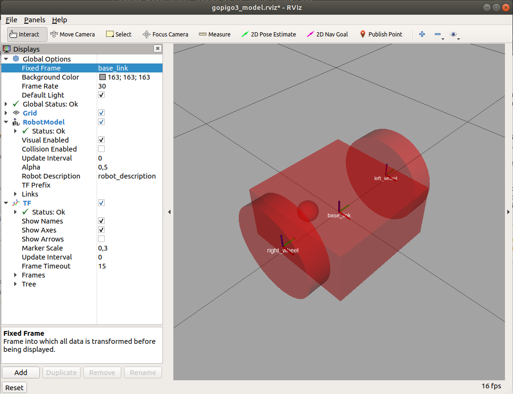
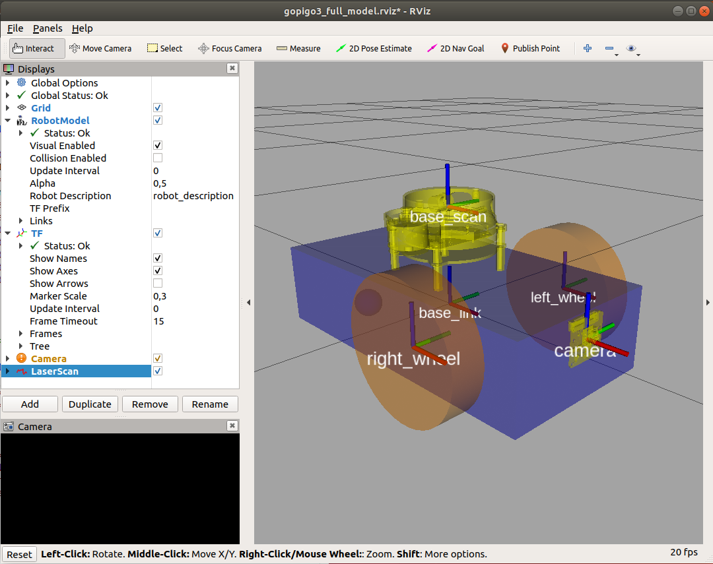
### **gopigo3 model improvements**
Some modifications in the initial model "gopigo3_init.gazebo" have been made to:
- locate the LIDAR in the correct position
- locate the camera axis in front position to see properly

Special attention has to be done to the YDLIDAR sensor.

- YDLIDAR X4 is a 360-degree two-dimensional rangefinder developed by YDLIDAR team. 
- Based on the principle of triangulation, it is equipped with related optics, electronics and algorithm design to achieve high-frequency and high-precision distance measurement. 
- The mechanical structure rotates 360 degrees to continuously output the angle information as well as the point cloud data of the scanning environment while ranging.
- 10m Ranging distance (2cm absolute error)

It is important to note that:
- the number of points of real YDLidar is 720 (one each half degree)
- the number of points of simulated Lidar has to be adapted to the same 720 (by default is 360 (one each degree))

> Be careful!:
> - Robots with RPlidar have been assembled with the motor in front position and then have the zero angle in its back
> - Robots with YDlidar have been assembled with the motor in back position and then have the zero angle in its front
>
> In this last case the model is defined by:
```xml
  <joint name="scan_joint" type="fixed">
    <parent link="base_link"/>
    <child link="base_scan"/>
    <origin rpy="0 0 0" xyz="-0.02 0 0.085"/>
  </joint>
  <link name="base_scan">
    <visual>
      <origin rpy="0 0 3.1416" xyz="0 0 0.02"/>
      <geometry>
        <mesh filename="package://gopigo3_description/meshes/sensors/X4.stl" scale="0.001 0.001 0.001"/>
      </geometry>
      <material name="orange"/>
    </visual>
```
> For slam & navigation purposes:
>- Zero angle is considered allways in its back
>- When using YDlidar robot, you will have to add a 180ª rotation across z axis:
```xml
<node if="$(eval model=='gopigo3yd.urdf')" pkg="tf" type="static_transform_publisher" name="base_link_to_base_scan"
    args="-0.033 0.0 0.08 3.14 0.0 0.0   /base_link /base_scan 40" />
```

#### **Using Xacro package**

Xacro (short for XML Macros) helps in reducing the overall size of the URDF file and makes it easier to read and maintain. It also allows us to create modules and reutilize them to create repeated structures, such as several arms or legs. With this package you can use costants, simple math and macros to create your robot model easier and compact.

Usefull information:
- http://wiki.ros.org/urdf/Tutorials/Using%20Xacro%20to%20Clean%20Up%20a%20URDF%20File
- https://www.theconstructsim.com/exploring-ros-2-wheeled-robot-part-02-xacros/

We have a public gopigo3_description package (https://github.com/ros-gopigo3/gopigo3) where the robot model is defined in xacro format within the files:
- gopigo3.urdf.xacro
- gopigo3.gazebo.xacro
- common_properties.xacro

To display the xacro model a specific display_xacro.launch file is created

To make convertion from xacro files to urdf file fotmat, type:
```shell
xacro gopigo3.urdf.xacro > gopigo3.urdf
```

You can display this new model in rviz
```shell
roslaunch gopigo3_description display.launch
```
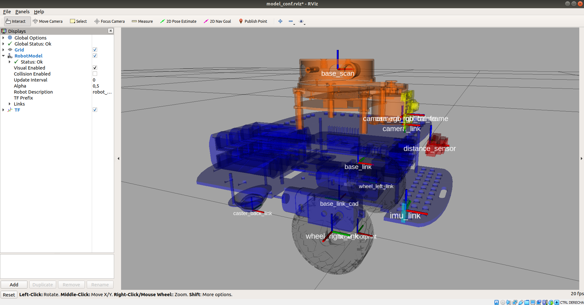

### **Final model:**
Create and verify in the final model taking care about:
- Activate all the sensors: in model.urdf.xacro verify if all the sensors are activated
    - Camera
    - Lidar
    - Distance sensor
    - IMU (usually IMU is not activated)
- Differential drive plugin: 
    - Take care about the maximum acceleration of wheels and torque. Usually we have to decrease this value to avoid slidings. We take acceleration 0.5 and torque 1
    - Be sure the Odom TF is published <publishOdomTF>true</publishOdomTF>
- Lidar plugin:
    - By default there are 500 samples with 0.72deg resolution you have to change this to 720 samples with 1 sample resolution

Edit the "gopigo3.urdf.xacro" file to verify the sensors included:
```xml
<!-- Which sensors to include -->
<xacro:arg name="imu" default="true" />
<!--xacro:property name="imu" value="true"/-->
<xacro:arg name="distance"        default="true"/>
<xacro:arg name="pi_camera"       default="true"/>
<xacro:arg name="lds"             default="true"/>
```
Edit the "gopigo3.gazebo.xacro" file to verify the sensors/actuators properties:
```xml
        <scan>
          <horizontal>
            <samples>720</samples>
            <resolution>1</resolution>
            <min_angle>0.0</min_angle>
            <max_angle>6.28319</max_angle>
          </horizontal>
        </scan>
```
## **2. rUBot gopigo3 spawn in world environment**

In robotics research, always before working with a real robot, we simulate the robot behaviour in a virtual environment close to the real one. The dynamic simulation of a robot, is a better approach to examining the actual behavior of the robot rather than just using software. Rigid body mechanics, including mass and inertia, friction, damping, motor controllers, sensor detection properties, noise signals, and every aspect of the robot and the environment that can be retained in a model with reasonable accuracy is much less expensive when replicated in a simulator than if you tried to do this with physical hardware.

Gazebo is an open source 3D robotics simulator and includes an ODE physics engine and OpenGL rendering, and supports code integration for closed-loop control in robot drives. This is sensor simulation and actuator control.

We will create a new spawn.launch file to spawn the robot in an empty world:
```shell
roslaunch gopigo3_description spawn.launch
```
```xml
<launch>
 <!-- We resume the logic in gazebo_ros package empty_world.launch, -->
  <include file="$(find gazebo_ros)/launch/empty_world.launch"/>
 <!-- Spawn gopigo3 robot into Gazebo -->
    <!-- Robot URDF definition -->
    <arg name="model" default="gopigo3.urdf" />
    <param name="robot_description" textfile="$(find gopigo3_description)/urdf/$(arg model)"/>
  <node name="spawn_model" pkg="gazebo_ros" type="spawn_model" output="screen"
      args="-urdf -model gopigo3 -param robot_description"/>
</launch>
```
You can create a very simple world "gopigo3.world" using gazebo:
- Type: sudo gazebo
- add some objects in the empty world
- save the final world to "worlds" folder

The robot could be spawn in a predefined position inside this new created world using this new spawn_world.launch file:
```xml
<launch>
    <!-- Define the needed parameters -->
    <arg name="world" default="gopigo3.world"/> 
    <arg name="model" default="gopigo3.urdf" />
    <arg name="x_pos" default="0.5"/>
    <arg name="y_pos" default="0.5"/>
    <arg name="z_pos" default="0.0"/>
  
    <include file="$(find gazebo_ros)/launch/empty_world.launch">
        <arg name="world_name" value="$(find gopigo3_description)/worlds/$(arg world)"/>
    </include>
    <!-- Spawn gopigo3 robot into Gazebo -->
       <!-- Robot URDF definition -->
       <param name="robot_description" textfile="$(find gopigo3_description)/urdf/$(arg model)"/>
    <node name="spawn_model" pkg="gazebo_ros" type="spawn_model" output="screen"
        args="-urdf -model gopigo3 -param robot_description -x $(arg x_pos) -y $(arg y_pos) -z $(arg z_pos)"/>
   </launch>
   ```
   Type the following to spawn the robot inside the world and test the sensor values using rviz:
```shell
roslaunch gopigo3_description spawn_world.launch
roslaunch gopigo3_description display.launch
```
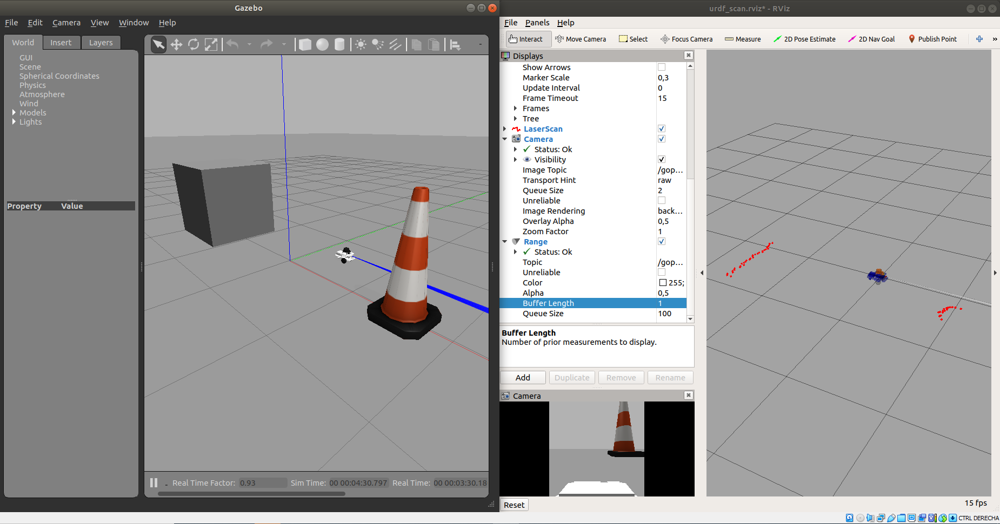
>Be careful!:
- If there is an error "libcurl: (51) SSL: no alternative certificate subject name matches target host name ‘api.ignitionfuel.org’" then follow instructions:
    - Open "~/.ignition/fuel/config.yaml" (to see the hidden files type ctrl+h)
    - replace: "api.ignitionfuel.org" with "fuel.ignitionrobotics.org"
    
  https://varhowto.com/how-to-fix-libcurl-51-ssl-no-alternative-certificate-subject-name-matches-target-host-name-api-ignitionfuel-org-gazebo-ubuntu-ros-melodic/

You can see the nodes and topics generated using rqt_graph


>In order to kill the previous Gazebo process, type:
>
>killall gzserver && killall gzclient
>
>or type ctrl+r and kill

### **Design the Project world**

Here we have first to design the project world, for exemple a maze from where our rUBot gopigo3 has to navigate autonomously.

There is a very useful and simple tool to design a proper world: "Building editor" in gazebo.

- Open gazebo as superuser:
```shell
sudo gazebo
```
- build your world using "Building Editor" in Edit menu


- save the generated model in a model folder (without extension)

- Close the Builder Editor, modify the model position and add other elements if needed. 
- save the generated world (with extension .world) in the world folder.

Once you finish is better to close the terminal you have worked as superuser

#### ***Modify a created world***
To modify a previously created world:
- Open a terminal where you have the world you want to modify
- type: sudo gazebo ./maze1.world
- make modifications
- save your world in the desired directory
- close gazebo and the terminal

#### **Create world with model parts**
You can create model parts like walls of 1m or 0,5m with a geometry and color, using building editor. These parts can be saved in "home/ubuntu/building_editor_models/" and you will have acces in gazebo insert section. Then you can construct your world adding these model parts.

This is an exemple:
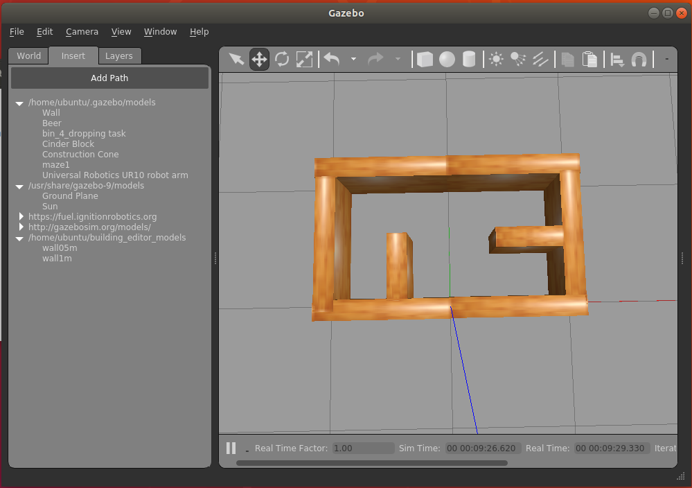

### **Exercise:**
Generate a proper world corresponding to the real world we want to spawn our gopigo3 robot in. For exemple a maze.

Use model parts in size 90cmx30cmx1cm and 60cmx30cmx1cm

Save this world as maze.world

### **Spawn the gopigo3 robot in project world**

Now, spawn the gopigo3 robot in our generated world. You have to create a "navigation.launch" file:

``` shell
roslaunch gopigo3_description navigation.launch
```


## **3. gopigo3 navigation control in the new world environment**

Once the world has been generated we will create a ROS Package "gopigo3_control" to perform the autonomous navigation.

This package is already created, but we will remind you how it is created:
```shell
cd ~/Desktop/rUBot_gopigo_ws/src
catkin_create_pkg gopigo3_control rospy std_msgs sensor_msgs geometry_msgs nav_msgs
cd ..
catkin_make
```

### **3.1. gopigo3 bringup**

Usually we first bring up the robot in a virtual environment.

A speciffic "gopigo3_bringup_sw.launch" file is created considering if you have rp or yd lidar installed.
```shell
roslaunch gopigo3_control gopigo3_bringup_sw.launch
```
The closed loop control structure is depicted below:

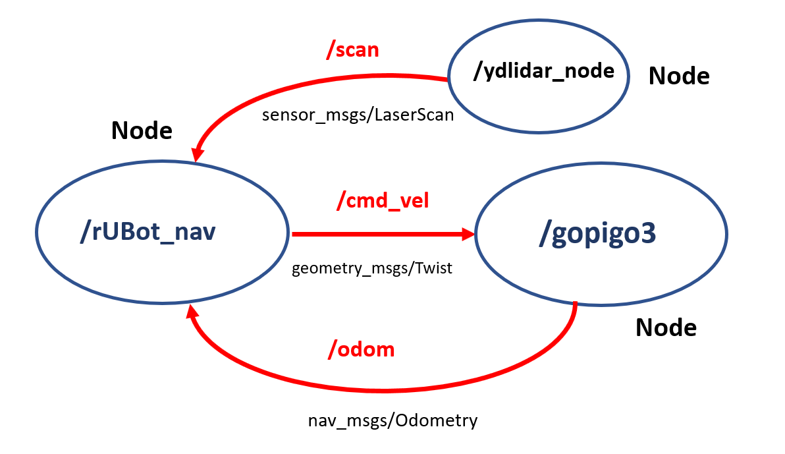

### **3.2. gopigo3 control with keyboard**

To control the robot with the Keyboard you have to install the "teleop-tools" package:

```shell
sudo apt-get install ros-noetic-teleop-tools
sudo apt-get install ros-noetic-teleop-twist-keyboard
```
Then you will be able to control the robot with the Keyboard typing:
```shell
roslaunch gopigo3_control gopigo3_bringup_sw.launch
rosrun key_teleop key_teleop.py /key_vel:=/cmd_vel
```
### **3.3. gopigo3 control with custom node**

To control the robot with a custom designed node, We will create a navigation python file in "src" folder:
- gopigo3_nav.py: to specify a twist message and a maximum distance

Specific launch file has been created to launch the node and python file created above:
```shell
roslaunch gopigo3_control gopigo3_bringup_sw.launch
roslaunch gopigo3_control node_nav.launch
```
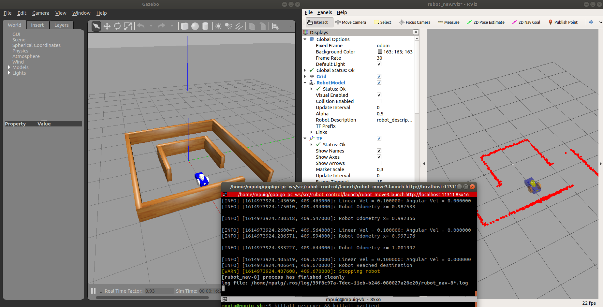

## **3.4. gopigo3 autonomous navigation and obstacle avoidance**
In order to navigate autonomously and avoid obstacles, we have created diferent python files in "src" folder:
- rubot_lidar_test.py: to test the LIDAR distance readings and angles
- rubot_self_nav.py: to perform a simple algorithm for navigation with obstacle avoidance
- rubot_wall_follow.py: to follow a wall preciselly for mapping purposes
- rubot_go2pose.py: to reach speciffic position and orientation

we will create also a "launch" folder including the corresponding launch files

#### **1. LIDAR test**
We have created a world to test the rubot model. This world is based on a square to verify that the LIDAR see the obstacle in the correct angle. We have to launch the "rubot_lidar_test.launch" file in the "gopigo3_control" package.

To launch this node type:
```shell
roslaunch gopigo3_control gopigo3_bringup_sw.launch
roslaunch gopigo3_control rubot_lidar_test.launch
rosrun key_teleop key_teleop.py /key_vel:=/cmd_vel
```
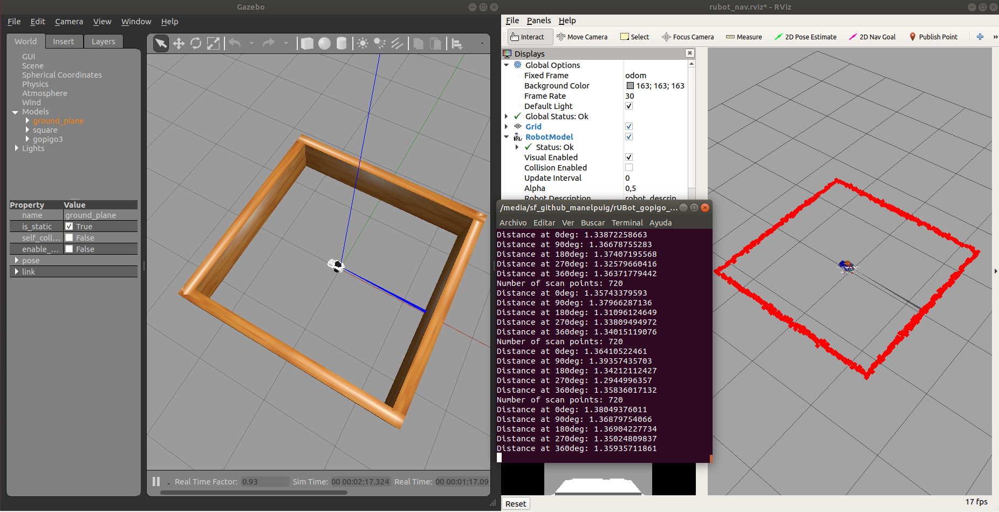

#### **2. Autonomous navigation with obstacle avoidance**
We will use now the created world to test the autonomous navigation with obstacle avoidance performance. 

We have to launch the "rubot_self_nav.launch" file in the "rubot_control" package.
```shell
roslaunch gopigo3_control gopigo3_bringup_sw.launch
roslaunch gopigo3_control rubot_self_nav.launch
```
>Be careful:
>- Verify in rviz if you have to change the fixed frame to "odom" frame

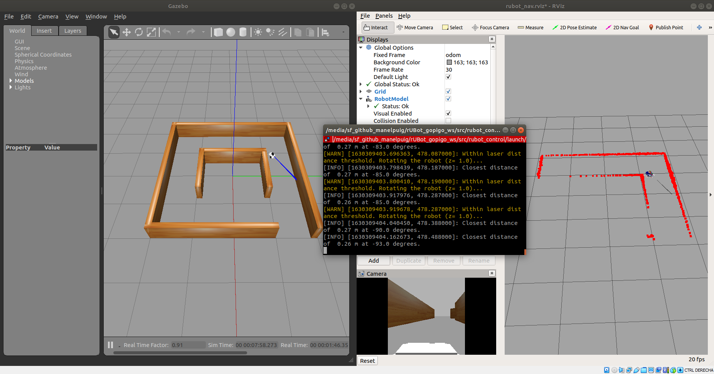
The algorithm description functionality is:
- "rubot_self_nav.py": The Python script makes the robot go forward. 
    - LIDAR is allways searching the closest distance and the angle
    - when this distance is lower than a threshold, the robot goes backward with angular speed in the oposite direction of the minimum distance angle.

#### **3. Wall Follower**
Follow the wall accuratelly is an interesting challenge to make a map with precision to apply SLAM techniques for navigation purposes.

There are 2 main tasks:
- Create a python file "rubot_wall_follower.py" to perform the wall follower in the maze of our gopigo3 robot
- Create a launch file to initialyse all the needed nodes in our system for this control task

We have developed 2 different methods for wall follower:
- Geometrical method
- Lidar ranges method

##### **a) Geometrical method**

Follow the instructions to perform the rubot_wall_follower_gm.py python program are in the notebook: 
https://github.com/Albert-Alvarez/ros-gopigo3/blob/lab-sessions/develop/ROS%20con%20GoPiGo3%20-%20S4.md

A rubot_wall_follower_gm.launch is generated to test the node within a specified world
```shell
roslaunch gopigo3_control gopigo3_bringup_sw.launch
roslaunch gopigo3_control rubot_wall_follower_gm.launch
```
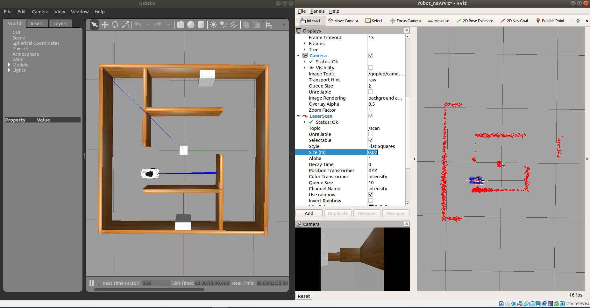

You can see a video for the Maze wall follower process in: 
[](https://youtu.be/z5sAyiFs-RU)


##### **b) Lidar ranges method**

We have created another rubot_wall_follower_rg.py file based on the reading distances from LIDAR in the ranges: front, front-right, front-left, right, left, back-right and back-left, and perform a specific actuation in function of the minimum distance readings.

Follow the instructions to create the rubot_wall_follower_rg.py python file: https://www.theconstructsim.com/wall-follower-algorithm/


The algorith is based on laser ranges test and depends on the LIDAR type:
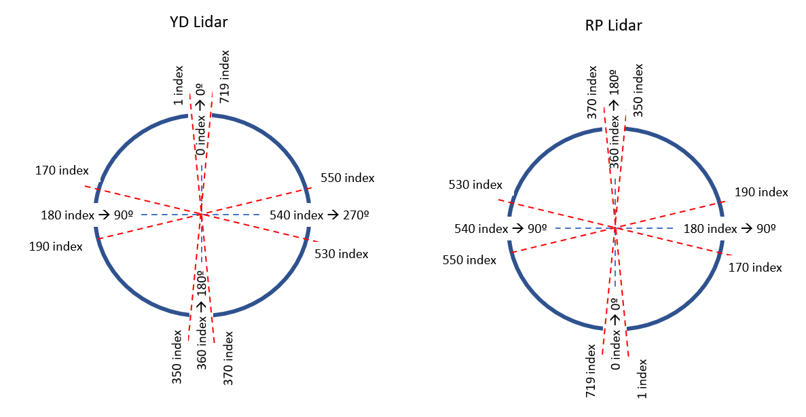

```shell
roslaunch gopigo3_control gopigo3_bringup_sw.launch
roslaunch gopigo3_control rubot_wall_follower_rg.launch
```


#### **4. Go to POSE**
Define a specific Position and Orientation as a target point to gopigo3 robot

x target point
y target point
f yaw orientation angle in deg

Modify the python script developed in turlesim control package according to the odom message type

For validation type:
```shell
roslaunch gopigo3_control gopigo3_bringup_sw.launch
roslaunch gopigo3_control rubot_go2pose.launch
```

