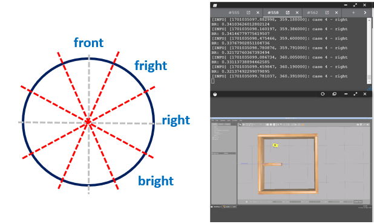

# **gopigo3 model & control**
The objectives of this chapter are:
- Create a model of our gopigo3 robot 
- Create a model of the virtual environment
- Bringup the robot in our virtual environment
- Control the robot movement with obstacle avoidance


The final model represents the real gopigo3 robot we will use in the laboratory

Interesting complementary information could be found:

- http://wiki.ros.org/Robots/gopigo3

- https://robots.ros.org/gopigo3/

- https://github.com/ros-gopigo3/gopigo3


## **1. rUBot gopigo3 model generation**

We have already created the "gopigo3_description" package to generate our robot model.
We remind you the needed instructions to create the package if you want to do it from zero:
```shell
cd /home/user/rUBot_gopigo_ws/src
catkin_create_pkg gopigo3_description rospy
cd ..
catkin_make
```
Then open the .bashrc file and verify the environment variables and source to the proper workspace:
```shell
source /home/user/rUBot_gopigo_ws/devel/setup.bash
```
To create our robot model, we use **URDF files** (Unified Robot Description Format). URDF file is an XML format file for representing a robot model (http://wiki.ros.org/urdf/Tutorials).

We have created 2 folders for model description:
- URDF: folder where different URDF models are located
- meshes: folder where 3D body models in stl format are located.

The main parts of URDF model are:
- links: diferent bodies/plastic elements
- joints: connection between 2 links 
- sensors & actuators plugins (2D camera, LIDAR and DC motors)

The **link definition** contains:
- visual properties: the origin, geometry and material
- collision properties: the origin and geomnetry
- inertial properties: the origin, mass and inertia matrix

The **joint definition** contains:
- joint Type (fixed, continuous)
- parent and child frames
- origin frame
- rotation axis

In the case or wright wheel:
```xml
<!-- Right Wheel -->
  <link name="right_wheel">
    <visual>
      <origin xyz="0 0 0" rpy="1.570795 0 0" />
      <geometry>
          <cylinder length="0.05" radius="0.1" />
      </geometry>
      <material name="orange"/>
    </visual>
    <collision>
      <origin xyz="0 0 0" rpy="1.570795 0 0" />
      <geometry>
          <cylinder length="0.05" radius="0.1" />
      </geometry>
    </collision>
    <inertial>
      <origin xyz="0 0 0" rpy="1.570795 0 0" />
      <mass value="0.15"/>
      <inertia ixx="0.01" ixy="0.0" ixz="0.0" iyy="0.005" iyz="0.0" izz="0.005"/>
    </inertial>
  </link>
  
  <!-- Right Wheel joint -->
  <joint name="joint_right_wheel" type="continuous">
    <parent link="base_link"/>
    <child link="right_wheel"/>
    <origin xyz="0 -0.30 0.025" rpy="0 0 0" /> 
    <axis xyz="0 1 0" />
  </joint>
```
The gopigo3 model includes different **sensors and actuators**:

**Sensors**:
- a two-dimensional camera: correspondas to RBPi camera
- a 360º LIDAR sensor RPLidar A1M8 (https://www.robotshop.com/es/es/rplidar-a1m8-kit-desarrollo-escaner-laser-360-grados.html)

**Actuator**:
- Differential drive actuator: based on 2 DC motors with encoders to obtain the Odometry information


**Gazebo plugins**:

The full model contains also information about the sensor and actuator controllers using specific **Gazebo plugins** (http://gazebosim.org/tutorials?tut=ros_gzplugins#Tutorial:UsingGazebopluginswithROS). 

Gazebo plugins give your URDF models greater functionality and compatiblility with ROS messages and service calls for sensor output and motor input. 

These plugins can be referenced through a URDF file, and to insert them in the URDF file, you have to follow the sintax:
- **Plugin for Differential drive actuator**:

The Differential Drive actuator contains:
- 2 wheels with radious R and separation B
- To obtain the driving tangencial velocity (v) and angular velocity (w) defined in the published Twist message on /cmd_vel topic, the plugin calculates the needed wheel velocities


```xml
 <!-- Differential Drive Controller -->
  <gazebo>
    <plugin filename="libgazebo_ros_diff_drive.so" name="gopigo3_controller">
      <commandTopic>cmd_vel</commandTopic>
      <odometryTopic>odom</odometryTopic>
      <odometryFrame>odom</odometryFrame>
      <odometrySource>world</odometrySource>
      <publishOdomTF>true</publishOdomTF>
      <robotBaseFrame>base_footprint</robotBaseFrame>
      <publishWheelTF>false</publishWheelTF>
      <publishTf>true</publishTf>
      <publishWheelJointState>true</publishWheelJointState>
      <legacyMode>false</legacyMode>
      <updateRate>30</updateRate>
      <leftJoint>wheel_left_joint</leftJoint>
      <rightJoint>wheel_right_joint</rightJoint>
      <wheelSeparation>0.116</wheelSeparation>
      <wheelDiameter>0.066</wheelDiameter>
      <wheelAcceleration>0.5</wheelAcceleration>
      <wheelTorque>1</wheelTorque>
      <rosDebugLevel>na</rosDebugLevel>
    </plugin>
  </gazebo>
  ```

- **Plugin for Raspicam sensor**:

This plugin reads the image from the camera and publishes the corresponding Image ros message to the /camera1/image_raw topic

```xml
  <!-- 2D Camera controller -->
  <gazebo reference="camera_rgb_frame">
    <sensor name="camera1" type="camera">
      <always_on>true</always_on>
      <visualize>false</visualize>
      <camera name="front">
        <horizontal_fov>1.3962634</horizontal_fov>
        <image>
          <width>800</width>
          <height>800</height>
          <format>R8G8B8</format>
        </image>
        <clip>
          <near>0.02</near>
          <far>300</far>
        </clip>
      </camera>
      <plugin filename="libgazebo_ros_camera.so" name="camera_controller">
        <alwaysOn>true</alwaysOn>
        <updateRate>30.0</updateRate>
        <cameraName>gopigo/camera1</cameraName>
        <imageTopicName>image_raw</imageTopicName>
        <cameraInfoTopicName>camera_info</cameraInfoTopicName>
        <frameName>camera_rgb_frame</frameName>
        <hackBaseline>0.07</hackBaseline>
        <distortionK1>0.0</distortionK1>
        <distortionK2>0.0</distortionK2>
        <distortionK3>0.0</distortionK3>
        <distortionT1>0.0</distortionT1>
        <distortionT2>0.0</distortionT2>
      </plugin>
    </sensor>
  </gazebo>
  ```
- **Plugin for LIDAR sensor**:

This sensor is integrated as a link and fixed joint for visual purposes. Review the joint and link definition in URDF model.

Note that rpLIDAR is mounted at 180º and you need to define a Yaw=180º in the link and joint definition in the URDF model.


```xml
  <!-- Laser Distance Sensor YDLIDAR X4 controller-->
  <gazebo reference="base_scan">
    <material>Gazebo/FlatBlack</material>
    <sensor name="lds_lfcd_sensor" type="ray">
      <pose>0 0 0 0 0 0</pose>
      <visualize>false</visualize>
      <update_rate>10</update_rate>
      <ray>
        <scan>
          <horizontal>
            <samples>720</samples>
            <resolution>1</resolution>
            <min_angle>0.0</min_angle>
            <max_angle>6.28319</max_angle>
          </horizontal>
        </scan>
        <range>
          <min>0.120</min>
          <max>10</max>
          <resolution>0.015</resolution>
        </range>
        <noise>
          <type>gaussian</type>
          <!-- Noise parameters based on published spec for YDLIDAR X4
               is 1.5% at half range 4m (= 60mm, "+-160mm" accuracy at max. range 8m).
               A mean of 0.0m and stddev of 0.020m will put 99.7% of samples
               within 0.16m of the true reading. -->
          <mean>0.0</mean>
          <stddev>0.02</stddev>
        </noise>
      </ray>
      <plugin filename="libgazebo_ros_laser.so" name="gazebo_ros_lds_lfcd_controller">
        <topicName>scan</topicName>
        <frameName>base_scan</frameName>
      </plugin>
    </sensor>
  </gazebo>
  ```
  It is important to note that:

- the number of points of real RPLidar depends on Lidar model (you will need tot test it first)
- the number of points of simulated Lidar is selected to 720

#### **Generated models in URDF**
Different model files have been created in:
- XACRO format: more compact format for complex models
- URDF format

These models are located in "urdf" folder:
- gopigo3rp.urdf.xacro
- gopigo3rp.urdf

> Robots have been assembled with the rpLIDAR considering that the zero angle in its front

**Robot model visualization tools**

We will visualize and simulate the generated robot models in :
- RVIZ
- GAZEBO

**RVIZ**: is a 3D visualization tool integral to robotics, enabling users to:
- visualize sensor data (such as laser scans, point clouds, and camera feeds), 
- display robot models, plan paths
- interactively analyze robot behavior in real-time
- It aids in debugging, verifying robot perception, and understanding its interaction with the environment by presenting a comprehensive visual representation of sensors data and trajectories

**GAZEBO**: is a powerful robot physical simulation software that provides:
- a virtual environment for testing, developing, and simulating robots 
- It allows users to create detailed simulations of robots, sensors, and environments, enabling experimentation without physical hardware
- facilitates testing algorithms, control strategies, and sensor placements, aiding in the validation and debugging of robotic applications
- Its realistic physics engine and customizable features make it a valuable tool for researchers, engineers, and roboticists to simulate and analyze robotic scenarios


To view the generated model we will use RVIZ with specific files:
- "gopigo_rviz.launch" for any urdf model
- "gopigo_rviz_xacro.launch" for any xacro model

Launch the ROS visualization tool to check that the model is properly built. 
RViz only represents the robot visual features. You have available all the options to check every aspect of the appearance of the model
```shell
roslaunch gopigo3_description gopigo_rviz.launch
```


>Colors in rviz:
>
>- are defined at the beginning of urdf file
>- Ensure the "visual" link properties have <material name="color">
```xml
<robot name="gopigo3">
  <material name="yellow">
    <color rgba="0.8 0.8 0.0 1.0"/>
  </material>
  ...
    <link name="base_link">
    <visual>
      <origin rpy="0 0 0" xyz="0 0 0"/>
      <geometry>
        <mesh filename="package://gopigo3_description/meshes/base_link.stl" scale="0.001 0.001 0.001"/>
      </geometry>
      <material name="yellow"/>
    </visual>
```

In robotics research, always before working with a real robot, we simulate the robot behaviour in a virtual environment close to the real one. For this purpose, we need to use **GAZEBO**.

We have created a "spawn.launch" file to spawn the robot in an empty world:
```shell
roslaunch gopigo3_description gopigo_gazebo.launch
```
>Colors in gazebo:
>
>- are defined at the end of urdf file:
```xml
<!-- Gazebo colors have to be specified here with predefined Gazebo colors -->
  <gazebo reference="base_link">
    <material>Gazebo/Yellow</material>
  </gazebo>
```

You can create a very simple world within gazebo:
- Maintain the Gazebo and RVIZ screens opened
- add some objects in the empty world

Now in RVIZ you will see the objects with the USB camera and Lidar


You can see the nodes and topics generated using rqt_graph


>To close the Gazebo is better to type in a new terminal:
```shell
pkill gzserver && pkill gzclient
```
**Activity: gopigo3 custom model**

Design a proper model corresponding to the real gopigo3 robot you will work with:

- Customized model colors (rviz and gazebo)
- Ensure the zero-angle lidar is located in the backside (publish TF in rviz)
- Add a number part on top with a fixed joint

To verify the final frame orientations (modify the launch files accordingly):
```shell
roslaunch gopigo_description gopigo_gazebo.launch
roslaunch gopigo_description gopigo_rviz.launch
```
Print the screen and upload the file to the corresponding task in Campus Virtual.


## **2. Design the Project world**

Here we have first to design the project world, for exemple a maze from where our rUBot gopigo3 has to navigate autonomously.

There is a very useful and simple tool to design a proper world: "**Building editor**" in gazebo.

- Open gazebo as superuser:
```shell
sudo gazebo
```
- build your world using "Building Editor" in Edit menu


- save the generated model in a model folder (without extension)
- Close the Builder Editor and modify the model position if needed
- open again Building editor to create new models
- to properly create a world using the generated models, add model folder to "insert" gazebo tab, pressing on "Add Path" and select the model folder
- create the world inserting models and placing them conveniently
- save the generated world (with extension .world) in the world folder.

Once you finish is better to close the terminal you have worked as superuser

#### ***Modify a created world***
To modify a previously created world:
- Open a terminal where you have the world you want to modify
- type: gazebo square.world
- make modifications
- save your world in the world folder
- close gazebo and the terminal

#### **Create world with model parts**
You can create model parts like walls of 120cm, 90cm and 60cm with a geometry and color, using building editor. These parts can be saved in models folder. Then you can construct your world adding these model parts.

This is an exemple:


**Bringup the gopigo3 robot in project world**

Now, you can bringup the gopigo3 robot in our generated world. 
We have created a "gopigo_bringup_sw.launch" file:

``` shell
roslaunch gopigo3_description gopigo_bringup_sw.launch
```


Gazebo, as a physical simulator creates a node that publishes messages to /odom, /scan and /gopigo/camera1/image_raw topics:


**Activity: gopigo3 custom world**

Design your proper world and spawn your gopigo3 model in speciffic pose.

Use model parts in size 120cmx30cmx1cm, 90cmx30cmx1cm and 60cmx30cmx1cm

Generate a proper bringup launch file to:
- Spawn your gopigo3 model in the generated world
- Specify the desired POSE
- Open RVIZ and visualize the main topics


## **3. gopigo3 Bringup and navigation in virtual environment**

Once the world has been generated we will create a ROS Package "gopigo3_control" to perform the navigation control.

This package is already created, but we will remind you how it is created:
```shell
cd /home/user/rUBot_gopigo_ws/src
catkin_create_pkg gopigo3_control rospy std_msgs sensor_msgs geometry_msgs nav_msgs
cd ..
catkin_make
```

Now we are ready to perform different laboratory sessions to analyse the Navigation performances of our gopigo3 robot. The different designed sessions will be:
- Robot bringup and Lidar test
- Robot navigarion performances
- Robot navigation with obstacle avoidance
- Robot wall follower project

These sessions have to be prepared previously with the performance verification in virtual environment (Gazebo). Students have to create and verify at home the needed code to reach the objectives of each laboratory session. The first part of each session are described the objectives and the home-work to verify the performances in virtual environment.

### **3.1. Robot bringup and Lidar test**
The Bringup consists of launching the different nodes responsible for the control of sensors and actuators in our real rUBot platform.

The rUBot platform has the following sensors and actuators:
-	4 Mecanum wheels controlled by DC servomotors
-	LIDAR sensor
-	USB Camera sensor

**In Virtual environment**

The model created in urdf format contains all the information about the robot structure and the sensors and actuators drivers as plugins in gazebo virtual environment.

The first action to do is to wake-up the robot and spawn-it inside the world. The robot model and the world have to be as close as possible to the real robot and real world. Then the generated code will work properly in the real world. 

This proces is the "bringup in virtual environment" and can be executed in a first terminal:
```shell
roslaunch gopigo3_description gopigo_bringup_sw.launch
```
The nodes and topics structure corresponds to the following picture:


This session is dedicated to analyse the rpLIDAR sensor. The simulated model considers that the Lidar sends 720 laser beams to sense the obstacles around the robot. To verify the LIDAR readings and angles we have generated the "rubot_lidar_test.py" python file.

To test the LIDAR we have generated a launch file:
```shell
roslaunch gopigo3_control rubot_lidar_test.launch
rosrun teleop_twist_keyboard teleop_twist_keyboard.py
```


Verify that your code is working before the laboratory session.

**In REAL environment**

In real environment, the bringup process depends on the real robot. You will have to launch the different nodes that wakes-up the robot. 

We have created a "gopigo_bringup_hw.launch" file that contains:
- launch the gopigo node that controls the robot kinematics
- launch the LIDAR node
- launch the camera node

We have first to install some HW packages:
- **gopigo3_node**
```shell
cd src
git clone https://github.com/ros-gopigo/gopigo3_node
```
- **rpLidar**
```shell
sudo apt install ros-noetic-rplidar-ros
```
- **Raspicam**

You can install package following instructions in:https://github.com/UbiquityRobotics/raspicam_node

```shell
cd src
git clone https://github.com/UbiquityRobotics/raspicam_node
```
To bringup the gopigo3 robot, execute in a first terminal:
```shell
roslaunch gopigo3_description gopigo_bringup_hw.launch
```
- **OpenCV**
```shell
sudo apt install ros-noetic-vision-opencv
```
Graphically, the final node structure will be:


Verify in rviz:
- The camera is sending images
- The lidar shows the distance to obstacles

Open a new terminal and verfy:
- the nodes 
- the topics
- the message types

Regarding the Lidar, you will see that each lidar device sends a different number of laser beams. To take into account this, you will have to modify the python program to:
- obtain the number of laser beams
- obtain a lidar factor corresponding to the laser-beams per degree
- obtain the distance reading on 0º, 90º, 180º, 270º and 360º

To test the LIDAR you have to generate a new launch file:
```shell
roslaunch gopigo3_control rubot_lidar_test2.launch
```
Could you answer these questions:
- Where is the lidar zero-index?
- How I have to modify the gopigo model to take into account the real lidar characteristics? Modifications have to be done in urdf model and "rplidar.launch"

**Delivery:**

Upload the:
- gopigo3_final.urdf model
- rplidar_final.launch


### **3.2. Robot Navigation performances**

The gopigo3 robot is based on 2 wheels and has a differential-drive kinematics model. We have first to analyse its kinematics model to properly control it.

**kinematics model**

Wheeled mobile robots may be classified in two major categories, holonomic (omnidirectional) and nonholonomic.

- Nonholonomic mobile robots, such as conventional cars, employ conventional wheels, which prevents cars from moving directly sideways.
- Holonomic mobile robots, such as mecanum cars, employ omni or mecanum wheels, which allow lateral and diagonal movements

The Kinematic model for our gopigo robot is a Differential Drive model that could be Holonomic and nonHolonomic because it is able to turn around itself. The Gazebo plugin contains the kinematic expressions that are sumarized:


**Navigation control in VIRTUAL environment**

We can control the movement of our robot using:

- the keyboard or a joypad
- programatically in python creating a "/rubot_nav" node

We first bringup our robot:
```shell
roslaunch gopigo3_description gopigo_bringup_sw.launch
```
The nodes and topics structure corresponds to the following picture:


And now we launch the node to publish the desired twist message to the /cmd_vel topic

**a) Keyboard control**

To control the robot with the Keyboard you have to install the "teleop-twist-keyboard" package:

```shell
sudo apt-get install ros-noetic-teleop-twist-keyboard
```
Then you will be able to control the robot with the Keyboard typing:
```shell
rosrun teleop_twist_keyboard teleop_twist_keyboard.py
```
**b) Python programming control**

A first simple navigation program is created to move the robot according to a speciffic Twist message.

We will create now a first navigation python files in "src" folder:

- rubot_nav.py: to define a rubot movement with linear and angular speed during a time td

Specific launch file have been created to launch the node and python file created above:

```shell
roslaunch gopigo3_control rubot_nav.launch
```


Verify first that the code is working in the simulated environment.

**Navigation control in REAL environment**

In real environment, the bringup process depends on the real robot. 

To bringup the gopigo3 robot, execute in a first terminal:
```shell
roslaunch gopigo3_description gopigo_bringup_hw.launch
```
Graphically, the final node structure will be:


Verify the previous node created to publish a Twist message to the /cmd_vel topic:
```shell
roslaunch gopigo3_control rubot_nav.launch
```
If the robot moves in the correct direction, you can follow with the next objective: Create a new node for **path trajectory** definition:
- Write a new rubot_path_nav.py python file that:
  - creates a rubot_nav node
  - includes parameters: v, w, and trajectory time
  - verify the functions: square_path() and triangular_path() 
  - define your proper function (star(), rombe(), etc.
  - Write the corresponding rubot_path_nav.launch file

Verify and demonstrate the execution:
```shell
roslaunch gopigo3_control rubot_nav.launch
```

**Delivery:**

Upload the:
- rubot_path_nav.launch and rubot_path_nav.py files
-	Video of the execution in REAL environment 


### **3.3. Autonomous navigation with obstacle avoidance**

We will use now the created world to test the autonomous navigation with obstacle avoidance performance.

The algorithm description functionality, created in "rubot_self_nav.py" file, is:
- The created node makes the robot go forward. 
    - LIDAR is allways searching the closest distance and the angle
    - when this distance is lower than a threshold, the robot goes backward with angular speed in the oposite direction of the minimum distance angle.

Let's verify first this behaviour in virtual environment 

**Self-navigation control in VIRTUAL environment**

We have to launch:
- the bringup sw file
- the "rubot_self_nav.launch"

```shell
roslaunch gopigo3_description gopigo_bringup_sw.launch
roslaunch gopigo3_control rubot_self_nav.launch
```
>Be careful:
>- Verify in rviz if you have to change the fixed frame to "odom" frame


You can test the behaviour when tunning the parameters defined

**Self-navigation control in REAL environment**

To bringup the gopigo3 robot, execute in a first terminal:
```shell
roslaunch gopigo3_description gopigo_bringup_hw.launch
```
Then verify the obstacle avoidance behaviour for different parameter values.
```shell
roslaunch gopigo3_control rubot_self_nav.launch
```
**Delivery:**

Upload the:
- rubot_self_nav.launch and rubot_self_nav.py files
-	Video of the execution in REAL environment 


### **3.4. Robot Wall follower project**

Follow the wall accuratelly is an interesting challenge to make a map with precision to apply SLAM techniques for navigation purposes.

There are 2 main tasks:
- Create a python file "rubot_wall_follower.py" to perform the wall follower in the maze of our gopigo3 robot
- Create a launch file to initialyse all the needed nodes in our system for this control task

**Wall follower in VIRTUAL environment**

We have developed 2 different methods for wall follower:
- Geometrical method
- Lidar ranges method

##### **Geometrical method**

Follow the instructions to perform the rubot_wall_follower_gm.py python program are in the notebook: 
https://github.com/Albert-Alvarez/ros-gopigo3/blob/lab-sessions/develop/ROS%20con%20GoPiGo3%20-%20S4.md


A rubot_wall_follower_gm.launch is generated to test the node within a specified world
```shell
roslaunch gopigo3_description gopigo_bringup_sw.launch
roslaunch gopigo3_control rubot_wall_follower_gm.launch
```


You can see a video for the Maze wall follower process in: 
[](https://youtu.be/z5sAyiFs-RU)


##### **Lidar ranges method**

We have created another rubot_wall_follower_rg.py file based on the reading distances from LIDAR in the ranges: front, front-right, right and back-right, and perform a specific actuation in function of the minimum distance readings.

Follow the instructions to create the rubot_wall_follower_rg.py python file: https://www.theconstructsim.com/wall-follower-algorithm/

The algorith is based on laser ranges test and depends on the LIDAR type:


The algorith is based on laser ranges defined on the LIDAR:



```shell
roslaunch gopigo3_description gopigo_bringup_sw.launch
roslaunch gopigo3_control rubot_wall_follower_rg.launch
```


**Wall follower in REAL environment**

To bringup the gopigo3 robot, execute in a first terminal:
```shell
roslaunch gopigo3_description gopigo_bringup_hw.launch
```
Then verify the obstacle avoidance behaviour for different parameter values.

**Geometric method**

```shell
roslaunch gopigo3_control rubot_wall_follower_gm.launch
```

**Ranges method**

```shell
roslaunch gopigo3_control rubot_wall_follower_rg.launch
```

**Delivery:**

Upload the:
- rubot_wall_follower_rg.launch and rubot_wall_follower_rg.py files
- rubot_wall_follower_gm.launch and rubot_wall_follower_gm.py files
-	Video of the execution in REAL environment

### **3.5. Robot go to pose**

Define a specific Position and Orientation as a target point to gopigo3 robot

x target point
y target point
f yaw orientation angle in deg

**Go to POSE in VIRTUAL environment**

A node is created in "rubot_go2pose.py" file to reach the POSE destination with a tolerance. We have modified the python script developed in turlesim control package according to the odom message type

For validation type:
```shell
roslaunch gopigo3_description gopigo3_bringup_sw.launch
roslaunch gopigo3_control rubot_go2pose.launch
```


Test different POSE targets before to test it with REAL robot.

**Go to POSE in REAL environment**

To bringup the gopigo3 robot, execute in a first terminal:
```shell
roslaunch gopigo3_description gopigo_bringup_hw.launch
```
Then verify the same node with the real gopigo robot:
```shell
roslaunch gopigo3_control rubot_go2pose.launch
```
**Delivery:**

Upload the:
- rubot_go2pose.launch and rubot_go2pose.py files
-	Video of the execution in REAL environment 
