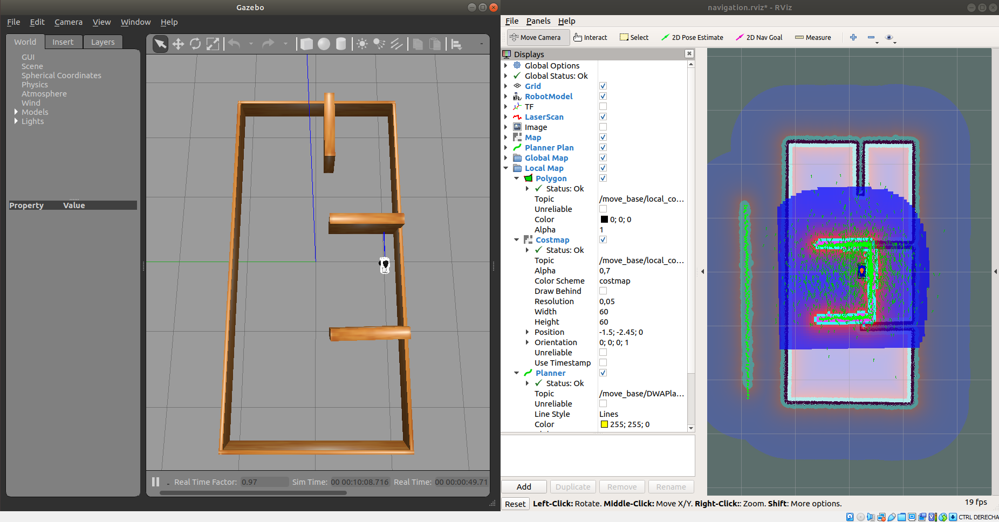
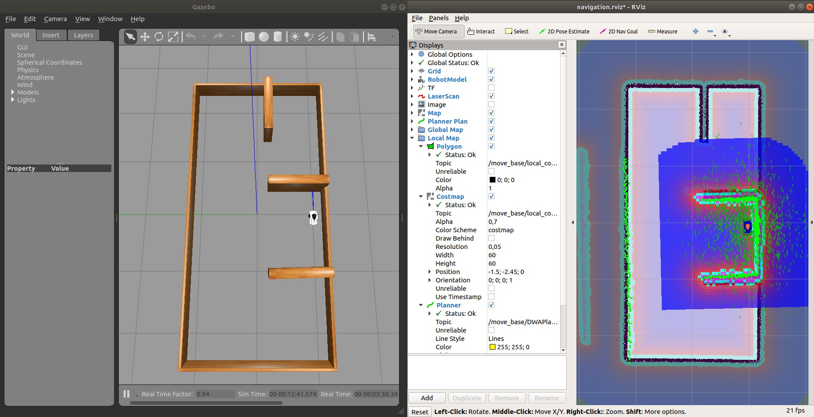
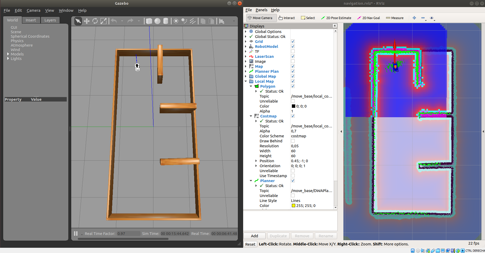
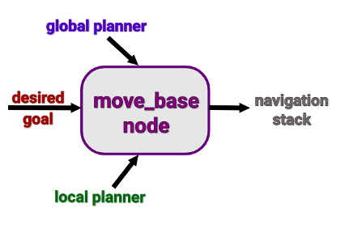

# **Gopigo SLAM & navigation**

Using SLAM (short for Simultaneous Localization and Mapping) techniques, you will be able to execute autonomous navigation with GoPiGo3.

SLAM is a technique used in robotics to explore and map an unknown environment while estimating the pose of the robot itself. As it moves all around, it will be acquiring structured information of the surroundings by processing the raw data coming from its sensors.

For optimal and easy-to-understand coverage of the topic of SLAM, we will implement a 360º-coverage LIDAR sensor in the virtual robot.

## **Install ROS navigation & SLAM packages**

First, let's prepare your machine with the required ROS packages needed for the navigation stack (http://wiki.ros.org/navigation):

```shell
sudo apt install ros-noetic-navigation
```

And finally the slam_gmapping package, that is already available in its binary version (https://wiki.ros.org/slam_gmapping)

```shell
sudo apt install ros-noetic-slam-gmapping
```

Also for some transformations you will need to install transforms3d
```shell
sudo pip3 install transforms3d
```

Open the .bashrc file and verify to source to the proper workspace:

```shell
source /home/user/rUBot_gopigo_ws_/devel/setup.bash
```

> change the path corresponding to your ws

## **What do you need to perform robot navigation with ROS?**

To perform navigation you need:

- Mapping: First, you need a map
- Localization: Next you need to localize the robot on that map
- Path Planning: Now you can send goal locations to the robot
- Obstacle avoidance: Finally, you need to avoid obstacles

## **Navigation with gopigo3 in a custom maze**

To navigate with gopigo3 robot in a custom maze we have first to create a virtual_slam package with dependencies:

- roscpp
- rospy
- std_msgs
- sensor_msgs
- geometry_msgs
- nav_msgs

The package "virtual_slam" is already created. Copy this folder to the src directory of your workspace and compile again your repository.

This repository is essentially the one corresponding to turtlebot3 adapted for the gopigo3 robot prototype:

 https://github.com/ROBOTIS-GIT/turtlebot3

Now you can follow the next steps:

### **1. Spawn the robot in our custom made maze**

We open a new terminal and type:

```shell
roslaunch gopigo3_description gopigo_world.launch
```

### **2. Generate the MAP**

We will start the slam_gmapping node. This node is highly configurable and has lots of parameters you can change in order to improve the mapping performance. (http://wiki.ros.org/gmapping)

Let's now check some of the most important ones that usually have to be changed:

- base_frame (default: "base_link"): Indicates the name of the frame attached to the mobile base.
- map_update_interval (default: 5.0): Sets the time (in seconds) to wait until update the map. (I take 1s)
- delta (default: 0.05): Sets the resolution of the map (I take 0.01m)

Open the "gmapping.launch" file and change properly the parameters you consider. Then launch the gopigo_slam file:

```shell
roslaunch gopigo3_slam gopigo_slam.launch
```

Teleoperate the robot to make it cover as much as possible of the surface of the current Gazebo world.

To obtain a softer movement with gopigo3 robot model be sure in gopigo3_custom.urdf model file, the differentialdrive pluggin has parameters are:

- Acceleration: 0.5
- Torque: 1

Let's do this as usual with the teleoperation package:

```shell
rosrun teleop_twist_keyboard teleop_twist_keyboard.py
```

Or use the navigation program you have designed to follow the walls for exemple to properly generate the map.

```shell
roslaunch gopigo3_control rubot_wall_follower_rg.launch
```

> Take care to launch only the wall_follower node

[](https://youtu.be/I6WwQv63Txw)

### **3. Open the MAP saver and save the map**

We can open now the map_saver file in map_server package to save the map in the local directory:

```shell
rosrun map_server map_saver -f square2_map
```

The map is generated with two files:

- square2_map.pgm (2D B&W map picture)
- square2_map.yaml (map parameters)

Provided with the map, we are ready to perform robot navigation with the GoPiGo3.

You can close now the "gopigo_slam.launch" file.

### **4. Robot Navigation**

When the robot moves around a map, it needs to know which is its POSE within the map.

The AMCL (Adaptive Monte Carlo Localization) package provides the amcl node, which uses the MCL system in order to track the localization of a robot moving in a 2D space. This node subscribes to the data of the laser, the laser-based map, and the transformations of the robot, and publishes its estimated position in the map.

On startup, the amcl node initializes its particle filter according to the parameters provided.

This AMCL node is also highly customizable and we can configure many parameters in order to improve its performance. (http://wiki.ros.org/amcl)

Let's have a look at some of the most important ones:

#### **General Parameters**

- odom_model_type (default: "diff"): It puts the odometry model to use. It can be "diff," "omni," "diff-corrected," or "omni-corrected."
- base_frame_id (default: "base_link"): Indicates the frame associated with the robot base.

#### **Costmap Parameters**

These parameters will allow you to configure the way that the navigation is performed and are located in "costmap_common_params.yaml" file:

- footprint: dimensions of the base_footprint for colision information
- Inflation radius: increase dimensions of obstacles to prevent colisions
- cost scaling factor: to define allowed regions among obstacles to define the optimal trajectory.

Review these parameters in "costmap_common_params.yaml"

```python
obstacle_range: 3.0
raytrace_range: 3.5
#robot_gopigo
footprint: [[-0.17, -0.06], [-0.17, 0.06], [0.09, 0.06], [0.09, -0.06]]
inflation_radius: 1.0
cost_scaling_factor: 5.0

map_type: costmap
observation_sources: scan
scan: {sensor_frame: base_scan, data_type: LaserScan, topic: scan, marking: true, clearing: true}
```

You can refine some parameters considering the recommendations in:
https://emanual.robotis.com/docs/en/platform/turtlebot3/navigation/#tuning-guide

> Careful!!
>
> global & local_costmap_params.yaml: specify the robot_base_frame as "base_footprint" link according to the URDF file. This link is the first one and has TF connection to the world

So, basically, we have to do the following:

- Open the gopigo3 robot in a desired world (if you have closed it before)

```shell
roslaunch gopigo3_description gopigo_world.launch
```

> Ensure you have the correct robot model name

- Open Navigation launch file including the map location:

```shell
roslaunch gopigo3_slam gopigo_navigation.launch
```

> Take care in launch file to read the correct robot model name and the correct map file in "maps" folder



- set up an initial pose by using the 2D Pose Estimate tool (which published that pose to the /initialpose topic).



- To obtain a proper localisation of your robot, move it right and left using the key_teleop.

```shell
rosrun teleop_twist_keyboard teleop_twist_keyboard.py
```



- Select the target goal to navigate with the tool "2D-Nav-Goal"

You can see some videos of Navigation process inside Hospital plant:

[](https://youtu.be/my33X_qWsjY)

[](https://youtu.be/r92mEQ9JAL8)

### **5. Programatic control of Robot Navigation**

When we want to perform a complex task, the robot navigation has to be made programatically. We will be able to perform:
- Init Pose selection
- Send a goal to navigation stack
- Send a sequence of goals to navigation stack

#### **5.1. Init Pose selection**

The init pose is a mesage that has to be published th a /initpose topic.

The message type is "PoseWithCovarianceStamped"

A simple program has been designed for this purpose in "init_pose.py". You have to select the correct pose in python file

```shell
roslaunch gopigo3_description gopigo_world.launch
roslaunch gopigo3_slam gopigo_navigation.launch
rosrun gopigo3_slam init_pose.py
```

#### **5.2. Send a goal to navigation stack**

The move_base ROS Node, allows to configure, run and interact with the robot navigation. The move_base node implements a SimpleActionServer with a single navigation goal.

The goal pose is of geometry_msgs/PoseStamped message type. 

To communicate with this node, the SimpleActionClient interface is used. The move_base node tries to achieve a desired pose by combining a global and a local motion planners to accomplish a navigation task which includes obstacle avoidance.



We can create a node to:
- Define a Init Pose
- Define a first navigation goal

The code is created in "first_goal.py" code

```shell
roslaunch gopigo3_description gopigo_world.launch
roslaunch gopigo3_slam gopigo_navigation.launch
rosrun gopigo3_slam first_goal.py
```

#### **5.3. Send a sequence of goals to navigation stack**

When different goals have to be defined, We will use a yaml file to define the waypoints and a launch file define the needed parameters.

We have to specify the waypoints as pose in (x,y,w) values and create a new create_pose_stamped(position_x, position_y, rotation_z) function

```shell
roslaunch gopigo3_description gopigo_world.launch
roslaunch gopigo3_slam gopigo_navigation.launch
rosrun gopigo3_slam waypoints_goal.py
```
If you want to work with ROS parameters, you can define the waypoints in a "waypoints.yaml" file on config folder:
```python
goal1: {"x": -0.5, "y": 0.8, "w": 90}
goal2: {"x": -0.5, "y": -0.5, "w": 180}
```
and load the yaml file in a "waypoints_goal.launch" file:
```xml
<launch>
  <node pkg="gopigo3_slam" type="waypoints_goal_params.py" name="movebase_client_waypoints" output="screen" >
    <rosparam file="$(find gopigo3_slam)/config/waypoints.yaml" command="load" />
  </node>
</launch>
```

```shell
roslaunch gopigo3_description gopigo_world.launch
roslaunch gopigo3_slam gopigo_navigation.launch
roslaunch gopigo3_slam waypoints_goal.launch
```
