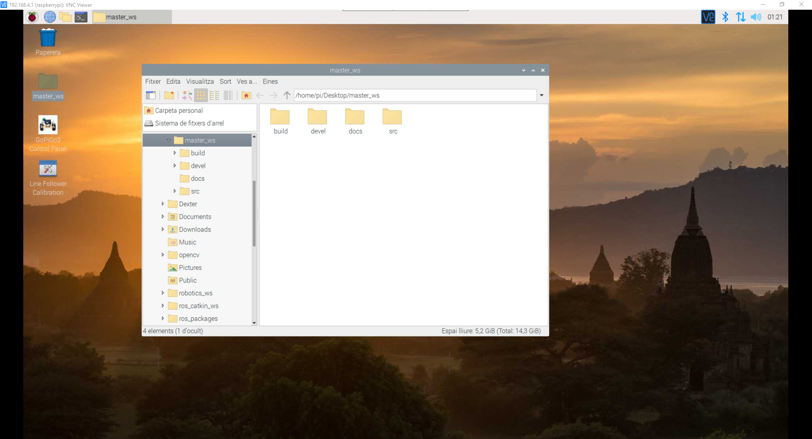
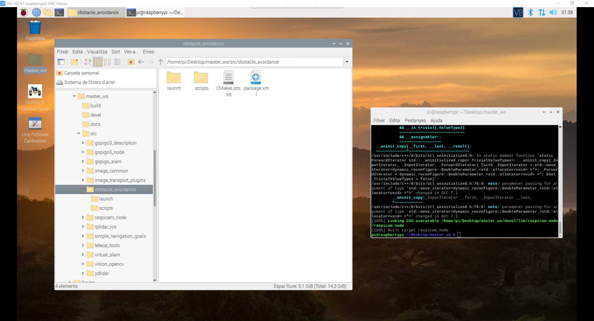
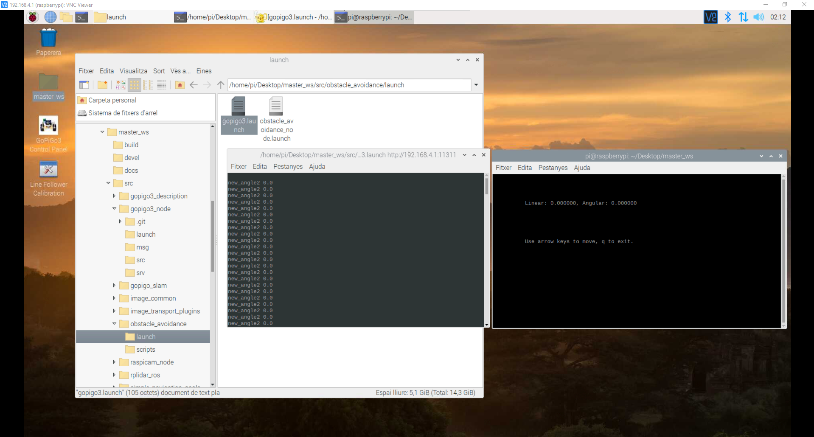
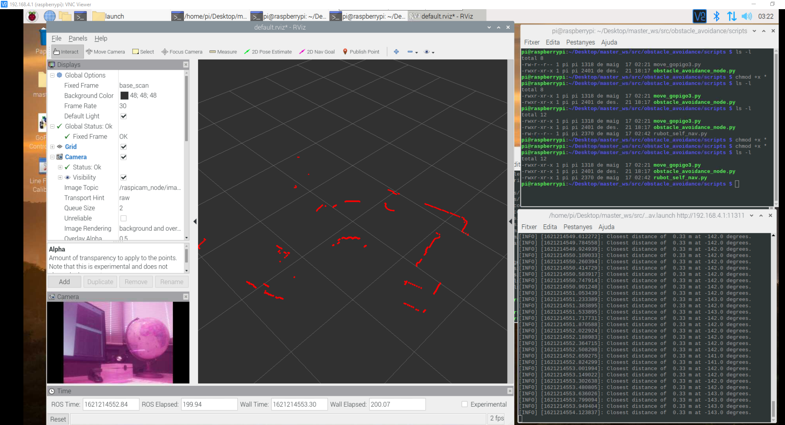

# **Control of gopigo3 in RaspberryPi**
In a hospital, a delivery robot carries samples or food from one room to another. 

The main objectives are:
- Assemble a real robot (gopigo3)
- Control the gopigo3 robot movement
- use SLAM (Simultaneous Localization and Mapping) techniques to generate and store a map of the room 
- use Navigation ROS package to find an optimal trajectory to reach a speciffic target position
- Define a route to be followed by the gopigo3 robot using Navigation package

let's see how to fulfill these objectives
## **1. Gopigo3 robot prototype setup**

This tobot prototype is based on:
- On-board computer based on raspberrypi3 board
- 2 DC-motor with encoder for differential drive controller
- RaspiCAM RGB camera
- LIDAR sensor


The raspberrypi3 onboard is preinstalled with:
- raspbian OS
- ROS source installation with rviz
- a "master_ws_original_copy" repository. You have NOT to use this repository. This could be used only in case you need to restart the repository with the original settings
- a "gopigo3_rbpi3_ws" repository. This will be used by the students to perform the project with gopigo3 robot. This folder will be placed in the raspberrypi3 Desktop.

This repository is located in /home/pi/Desktop folder and it is already compiled.

### **Raspberrypi configuration and setup**

The raspberrypi4 is configured:
- to generate a hotspot 
- LIDAR activated 
- raspicam activated 

When powering the raspberrypi4, generates a hotspot you have to connect to:
- SSID name: rubot_10 
- password "CorrePiCorre"

Once you are connected to this network you will be able to connect your computer to the raspberrypi4 using Nomachine Display:
- download and install the Nomachine for windows at: 
- Select the raspberrypi IP address: 10.42.0.1
- you have to specify:
    - user: pi
    - password: ubuntu0ubuntu1
- You will have the raspberrypi desktop on your windows nomachine screen



The first time you have to clone the "rUBot_gopigo_ws" repository to the home folder.
```shell
cd /home
git clone https://github.com/manelpuig/rUBot_gopigo_ws
cd rUBot_gopigo_ws
catkin_make
```

>Carefull!: Some actions have to be done:
- review the ~/.bashrc: source to the ws and delete the environment variables
- make executable the c++ and python files


### **1. gopigo bringup**

To properly perform a especific movement control we have first to install some HW packages:
> Information is in: https://forum.dexterindustries.com/t/setup-python3-gopigo3-and-di-sensors-on-ubuntu-server-20-04-64-bit-for-non-root-access/8305

#### **1.1 gopigo3_node**
This node is responsible to drive the wheels and obtain the odometry

You have to clone (or copy) the repository in src folder
```shell
cd src
git clone https://github.com/ros-gopigo/gopigo3_node
```
#### **1.2 LIDAR**
This node is responsible to see the obstacle distances 360º arround. We have 2 different LIDAR models (RPLIDAR and YDLIDAR) and we will install the 2 packages

a) RPLIDAR

This can be installed with apt (in opt/ros/noetic/share folder)
```shell
sudo apt install ros-noetic-rplidar-ros
```
or clone (or copy) the repostory in src folder
```shell
cd src
git clone https://github.com/Slamtec/rplidar_ros
```
b) YDLIDAR

This can be installed clonning (or copying) the package in src folder:
```shell
cd src
git clone https://github.com/EAIBOT/ydlidar
```

#### **1.3. RASPICAM**
This node is responsible to view images from camera

First of all we have to open /boot/firmware/config.txt file and add:
```shell
start_x=1
gpu_mem=128
```
then you can install package following instructions in:https://github.com/UbiquityRobotics/raspicam_node

```shell
cd src
git clone https://github.com/UbiquityRobotics/raspicam_node
```
#### **1.4. OPEN CV**
This package is used for image processing with OpenCV and ROS

This can be installed with apt (in opt/ros/noetic/share folder)
```shell
sudo apt install ros-noetic-vision-opencv
```
or clone (or copy) the repostory in src folder
```shell
cd src
git clone https://github.com/ros-perception/vision_opencv
```
#### **1.5. Teleop-tools**
This package is used to control robot with keyboard or joypad

This can be installed with apt (in opt/ros/noetic/share folder)
```shell
sudo apt install ros-noetic-teleop-tools
```
or clone (or copy) the repostory in src folder
```shell
cd src
git clone https://github.com/ros-teleop/teleop_tools
```

Once all drivers are installed, you can compile the ws and proceed for the bringup

#### **1.6. Bringup**
Now you can bringup our robot:
- launch the gopigo3 node: able to control de 2 motors and measure the odometry
- launch the raspicam node
- launch the LIDAR sensor node

This is done in the 


A launch file is made to automatically make the bringup hardware:
```shell
roslaunch gopigo3_control gopigo3_bringup_hw.launch
```

## **2. gopigo3 first control movements**
First, let's control the gopigo3 movement to perform:
- movement control using keyboard
- movement control with specific python script
- autonomous navigation
- autonomous navigation following right or left wall
- Navigation to speciffic POSE

We have created a specific package "gopigo_control" where all these controls are programed.
You can review from the "gopigo3_rbpi3_ws" workspace the src/gopigo_control folder where there are 2 new folders:
- scrip folder: with the python programs for specific movement control
- launch folder: with programs to launch the movement control



### **2.1. Keyboard movement control**

To control the gopigo robot with keyboard, we need to install "teleop_tools" package. This is already installed in our master_ws as you can see in the previous figure.

Open a new terminal and type:
```shell
rosrun key_teleop key_teleop.py /key_vel:=/cmd_vel
```

Carefull: if there are problems, make a source in each terminal



Open a new terminal and see all the nodes and topics involved:
```shell
rqt_graph
```
Pres q and crtl+C to close the terminals

### **2.2. Movement control with specific python script**

You want to perform the movement control in "move3_gopigo_distance.py" simulation ws.

You will only need to:
- copy this python file to the script folder
- create a new "move_gopigo3.launch" file to launch gopigo3 and the control node

>Carefull!: be sure the new python file is executable. 

Type:
```shell
roslaunch gopigo_control move_gopigo3.launch
```
```xml
<launch>
  <node name="gopigo3" pkg="gopigo3_node" type="gopigo3_driver.py" output="screen" />
  <!-- run gopigo   -->
  <arg name="v" default="0.1"/>
  <arg name="w" default="0"/>
  <arg name="d" default="0.3"/>
  <node pkg="gopigo_control" type="move_gopigo3.py" name="rubot_nav" output="screen" >
    <param name="v" value="$(arg v)"/>
    <param name="w" value="$(arg w)"/>
    <param name="d" value="$(arg d)"/>
  </node>
</launch>
```
### **3. Autonomous navigation**

For autonomous navigation you need the LIDAR sensor.

First test your LIDAR angles with the program: rubot_lidar_test.py

We will have to launch the following nodes:
- the gopigo3 node for driving control
- the ydlidar node (or rplidar)
- the raspicam node
- the lidar_test node

To launch these nodes we need one terminal for each node. We will execute in different terminals:

type the following commands to each terminal:
```shell
roslaunch gopigo3_node gopigo3.launch
roslaunch ydlidar lidar.launch (or roslaunch rplidar_ros rplidar.launch)
roslaunch raspicam_node camerav2_1280x960_10fps.launch enable_raw:=true camera_frame_id:="laser_frame"
rosrun gopigo_control rubot_lidar_test.py
```
You need to verify that the forward direction corresponds to the zero angle. Is it true???

Now you can perform the autonomous navigation defined in "rubot_self_nav.py"

Carefull!: be sure the new python file is executable

We will have to launch the following nodes:
- the gopigo3 node for driving control
- the ydlidar node (or rplidar)
- the raspicam node
- the rubot_nav node for autonomous navigation

You can create a compact "rubotYD_self_nav.launch" file for gopigo3 robots using YDLidar (similar for the RPLidar):

```shell
roslaunch gopigo_control rubotYD_self_nav.launch
```
```xml
<launch>
  <!-- launch gopigo3   -->
  <include file="$(find gopigo3_node)/launch/gopigo3.launch"/>
  <!-- launch ydlidar   -->
  <include file="$(find ydlidar)/launch/lidar.launch"/>

  <!-- launch raspicam   -->
  <include file="$(find raspicam_node)/launch/camerav2_1280x960_10fps.launch">
	<arg name="enable_raw" value="true"/>
	<arg name="camera_frame_id" value="base_scan"/>
  </include>
  <!-- launch obstacle avoidance   -->
    <arg name="LIDAR" default="YD" />
    <arg name="distance_laser" default="0.3" />
    <arg name="speed_factor" default="0.1"/>
    <arg name="forward_speed" default="2" />
    <arg name="backward_speed" default="-1" />
    <arg name="rotation_speed" default="20" />
    <node name="rubot_nav" pkg="gopigo_control" type="rubot_self_nav.py" output="screen" >
        <param name="LIDAR" value="$(arg LIDAR)"/>
        <param name="distance_laser" value="$(arg distance_laser)"/>
        <param name="speed_factor" value="$(arg speed_factor)"/>
        <param name="forward_speed" value="$(arg forward_speed)"/>
        <param name="backward_speed" value="$(arg backward_speed)"/>
        <param name="rotation_speed" value="$(arg rotation_speed)"/>
    </node>    
  <!-- Show in Rviz   -->
  <!--<node name="rviz" pkg="rviz" type="rviz" args="-d $(find gopigo_control)/rviz/laserscan.rviz"/>-->
</launch>
```
In order to see the rubot with the topics information we will use rviz. Open rviz in a new terminal.

In rviz, select the fixed frame to "base_scan", and add Camera and LaserScan with the corresponding topics names.

You can then save the config file as laserscan.rviz name and use it in the launch file


A launch file is created to integrate all the needed roslaunch parameters but you can change the defauld values with this syntax:
```shell
roslaunch gopigo_control rubotYD_self_nav.launch distance_laser:=0.2 speed_factor:=1.3
```
### **4. Wall Follower**

This control task consist on find a wall and follow it at a certain distance. We will see that this is an important control task because this will be used later to make accurate maps of working environments.

There are 2 main tasks:
- Create a python file to perform the wall follower in the maze of our gopigo3 robot
- Create a launch file to initialyse all the needed nodes in our system for autonomous navigation

We have developed 2 different methods for wall follower:
- Geometrical method
- Lidar ranges method

#### **a) Geometrical method**
In src folder you create the python file for wall follower purposes

The instructions to perform the python program are in the notebook: 

https://github.com/Albert-Alvarez/ros-gopigo3/blob/lab-sessions/develop/ROS%20con%20GoPiGo3%20-%20S4.md


Create a launch folder for the launch files taking into account if you are using an YD or RP LIDAR
```shell
roslaunch gopigo_control rubotRP_wall_follower_gm.launch
```
```xml
<launch>
  <!-- launch gopigo3   -->
  <include file="$(find gopigo3_node)/launch/gopigo3.launch"/>
  <!-- launch rplidar   -->
  <include file="$(find rplidar_ros)/launch/rplidar.launch"/>
 
  <!-- launch raspicam   -->
  <!--<include file="$(find raspicam_node)/launch/camerav2_1280x960_10fps.launch">
	<arg name="enable_raw" value="true"/>
	<arg name="camera_frame_id" value="base_scan"/>
  </include>-->
  <!-- launch follow wall   -->
  <arg name="LIDAR" default="RP" />
  <arg name="kp" default="0.5" />
  <arg name="distance_reference" default="0.3" />
  <arg name="lookahead_distance" default="0.4" />
  <arg name="forward_speed" default="0.04" />
  <arg name="theta" default="50.0" />
  <node name="wall_follower_controller" pkg="gopigo_control" type="rubot_wall_follower_gm.py" output="screen" >
    <param name="LIDAR" value="$(arg LIDAR)"/>
    <param name="kp" value="$(arg kp)"/>
    <param name="distance_reference" value="$(arg distance_reference)"/>
    <param name="lookahead_distance" value="$(arg lookahead_distance)"/>
    <param name="forward_speed" value="$(arg forward_speed)"/>
    <param name="theta" value="$(arg theta)"/>
  </node>
  <!-- Show in Rviz   -->
  <!--<node name="rviz" pkg="rviz" type="rviz" args="-d $(find obstacle_avoidance)/rviz/laserscan.rviz"/>-->
</launch>
```
You can see the video result:

[](https://youtu.be/z5sAyiFs-RU)
#### **b) ranges method**
In src folder you create the python file for wall follower purposes

The algorith is based on laser ranges test and depends on the LIDAR type:


Take into account that:
- RP LIDAR has 180º rotation
- YDlidar in front direction has 2 different ranges [660:719] and [0:60]
- YDlidar sends some 0 values due to wrong readings. They have to be changed to high value to be able to take the minimum falue from the desired range.

The "rubot_wall_follower_rg_filter.py" has to integrate this in callback function

``` python
def clbk_laser(msg):
    global regions_, LIDAR
    if LIDAR == "RP":
	    regions_ = {
		'left':  min(min(msg.ranges[539:541]), 3),
		'fleft': min(min(msg.ranges[421:538]), 3),
		'front':  min(min(msg.ranges[300:420]), 3),
		'fright':  min(min(msg.ranges[182:300]), 3),
		'right':   min(min(msg.ranges[179:181]), 3),
	    }
	    print ("LIDAR: RP")
    else:
        for i, val in msg.ranges:
            if val == 0:
                msg.ranges[i]=3 # YD Lidar sends some 0 values and then the minimum is allways 0
	    regions_ = {
		'left':  min(min(msg.ranges[179:181]), 3),
		'fleft': min(min(msg.ranges[60:178]), 3),
		'front':  min(min(msg.ranges[661:719]),min(msg.ranges[0:59]), 3),
		'fright':  min(min(msg.ranges[542:660]), 3),
		'right':   min(min(msg.ranges[539:541]), 3),
	    }
	    print ("LIDAR: YD")
 
    print ("front distance: "+ str(regions_["front"]))
    print ("right distance: "+ str(regions_["right"]))
    print ("front-right distance: "+ str(regions_["fright"]))

    take_action()
```
Type:
```shell
roslaunch gopigo_control rubotRP_wall_follower_rg.launch
```
```xml
<launch>
  <!-- launch gopigo3   -->
  <include file="$(find gopigo3_node)/launch/gopigo3.launch"/>
  <!-- launch ydlidar   -->
  <include file="$(find rplidar_ros)/launch/rplidar.launch"/>

  <!-- launch raspicam   -->
  <!--<include file="$(find raspicam_node)/launch/camerav2_1280x960_10fps.launch">
	<arg name="enable_raw" value="true"/>
	<arg name="camera_frame_id" value="base_scan"/>
  </include>-->
  <!-- launch follow wall   -->
	<arg name="LIDAR" default="RP" />
  <node name="wall_follow" pkg="gopigo_control" type="rubot_wall_follower_rg.py" output="screen" >
	<param name="LIDAR" value="$(arg LIDAR)"/>
  </node>
  <!-- Show in Rviz   -->
  <!--<node name="rviz" pkg="rviz" type="rviz" args="-d $(find obstacle_avoidance)/rviz/laserscan.rviz"/>-->
</launch>
```
### **5. Go to POSE**

The objective is to program the robot to reach a speciffic target POSE defining:
- x position
- y position
- angle orientation (from 0º to 180º)

We can take the same python script you have programed for simulated Gazebo environment

Type:

```shell
roslaunch gopigo_control rubotYD_go2pose.launch
```
