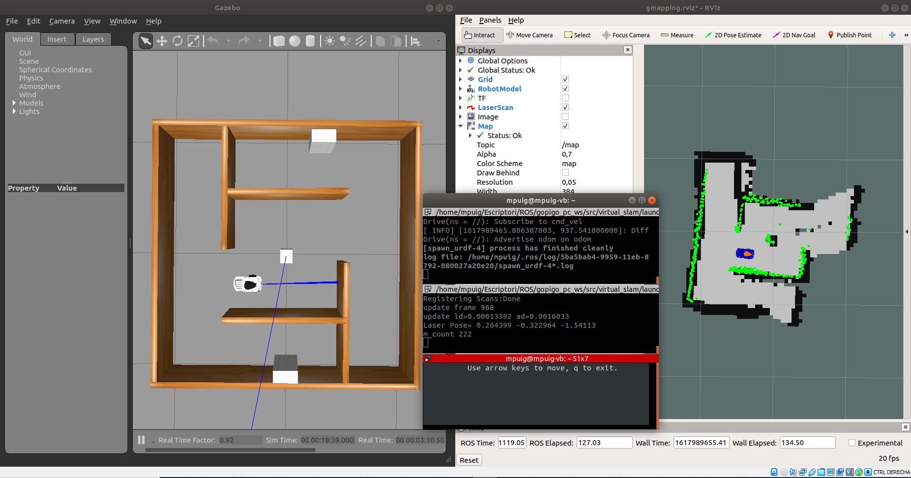
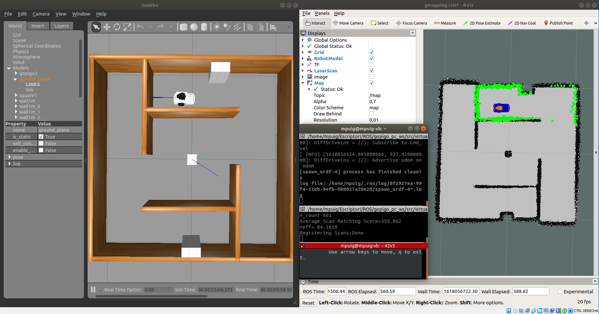

# **Gopigo SLAM & navigation**
Using SLAM (short for Simultaneous Localization and Mapping) techniques, you will be able to execute autonomous navigation with GoPiGo3.

SLAM is a technique used in robotics to explore and map an unknown environment while estimating the pose of the robot itself. As it moves all around, it will be acquiring structured information of the surroundings by processing the raw data coming from its sensors.

For optimal and easy-to-understand coverage of the topic of SLAM, we will implement a 360º-coverage LIDAR sensor in the virtual robot. 

## **Install ROS navigation & SLAM packages**
First, let's prepare your machine with the required ROS packages needed for the navigation stack (http://wiki.ros.org/navigation):
```shell
sudo apt install ros-melodic-navigation
```
And finally the slam_gmapping package, that is already available in its binary version (https://wiki.ros.org/slam_gmapping)
```shell
sudo apt install ros-melodic-slam-gmapping
```
Open the .bashrc file and verify to source to the proper workspace:
```shell
source /media/sf_github_manelpuig/rUBot_gopigo_ws_/devel/setup.bash
```
> change the path correcponding to your ws
## **What do you need to perform robot navigation with ROS?**
To perform navigation you need:
- Mapping: First, you need a map
- Localization: Next you need to localize the robot on that map
- Path Planning: Now you can send goal locations to the robot
- Obstacle avoidance: Finally, you need to avoid obstacles
## **Navigation with gopigo3 in a custom maze**
To navigate with gopigo3 robot in a custom maze we have first to create a virtual_slam package with dependencies:
- roscpp
- rospy
- std_msgs
- sensor_msgs
- geometry_msgs
- nav_msgs

The package "virtual_slam" is already created. Copy this folder to the src directory of your workspace and compile again your repository.

This repository is essentially the one corresponding to turtlebot3:

 https://github.com/ROBOTIS-GIT/turtlebot3 

Now you can follow the next steps:
### **1. Spawn the robot in our custom made maze**
We open a new terminal and type:
```shell
roslaunch virtual_slam gopigo3_world.launch
```
### **2. Generate the MAP**
We will start the slam_gmapping node. This node is highly configurable and has lots of parameters you can change in order to improve the mapping performance. (http://wiki.ros.org/gmapping)

Let's now check some of the most important ones that usually have to be changed:

- base_frame (default: "base_link"): Indicates the name of the frame attached to the mobile base.
- map_update_interval (default: 5.0): Sets the time (in seconds) to wait until update the map. (I take 1s)
- delta (default: 0.05): Sets the resolution of the map (I take 0.01m)
- linearUpdate (default: 1.0): Sets the linear distance that the robot has to move in order to process a laser reading.
- temporalUpdate (default: -1.0): Sets the time (in seconds) to wait between laser readings. If this value is set to -1.0, then this function is turned off.

Open the "gmapping.launch" file and change properly the parameters you consider. Then launch the gopigo_slam file:
```shell
roslaunch virtual_slam gopigo3_slam.launch
```
Teleoperate the robot to make it cover as much as possible of the surface of the current Gazebo world. Let's do this as usual with the teleoperation package:
```shell
rosrun key_teleop key_teleop.py /key_vel:=/cmd_vel
```
Or use the navigation program you have designed to follow the walls for exemple to properly generate the map.
```shell
roslaunch rubot_control node_wall_follower_gm.launch
```
> Take care to launch only the wall_follower node


### **3. Open the MAP saver and save the map**
We can open now the map_saver file in map_server package to save the map in the local directory:
```shell
rosrun map_server map_saver -f Hospital2
```
The map is generated with two files of the formats indicated in the preceding SLAM process subsection, that is, .pgm and .yaml

If we use the standard default parameter values we obtain:
```python
image: ./test_map.pgm
resolution: 0.010000
origin: [-20.000000, -20.000000, 0.000000]
negate: 0
occupied_thresh: 0.65
free_thresh: 0.196
```
We can optimize the map using new parameter values of "gmapping.launch":
- delta: 0.05 --> 0.01 (resolution in m)
- map_update_interval: 2 --> 1 (in s)

And from the gopigo3.urdf model in differentialdrive pluggin:
- Acceleration: 0.5
- Torque: 1

we obtain a more accurate movement and map resolution



You will get two files in the specified folder of your workspace: Hospital2.pgm and Hospital2.yaml.

Provided with the map, we are ready to perform robot navigation with the GoPiGo3.

### **3. Robot Navigation**
When the robot moves around a map, it needs to know which is its POSE within the map.

The AMCL (Adaptive Monte Carlo Localization) package provides the amcl node, which uses the MCL system in order to track the localization of a robot moving in a 2D space. This node subscribes to the data of the laser, the laser-based map, and the transformations of the robot, and publishes its estimated position in the map. On startup, the amcl node initializes its particle filter according to the parameters provided.

This AMCL node is also highly customizable and we can configure many parameters in order to improve its performance. (http://wiki.ros.org/amcl)

Let's have a look at some of the most important ones:

### **General Parameters**

- odom_model_type (default: "diff"): It puts the odometry model to use. It can be "diff," "omni," "diff-corrected," or "omni-corrected."
- base_frame_id (default: "base_link"): Indicates the frame associated with the robot base.

### **Filter Parameters**

These parameters will allow you to configure the way that the particle filter performs.
- update_min_d (default: 0.2): Sets the linear distance (in meters) that the robot has to move in order to perform a filter update.
- update_min_a (default: π/6.0): Sets the angular distance (in radians) that the robot has to move in order to perform a filter update.

### **footprint dimensions**

Review the dimensions in "costmap_common_params.yaml"
```python
obstacle_range: 3.0
raytrace_range: 3.5

footprint: [[-0.17, -0.06], [-0.17, 0.06], [0.09, 0.06], [0.09, -0.06]]

inflation_radius: 1.0
cost_scaling_factor: 3.0

map_type: costmap
observation_sources: scan
scan: {sensor_frame: base_scan, data_type: LaserScan, topic: scan, marking: true, clearing: true}
```

You can refine some parameters considering the recommendations in:
https://emanual.robotis.com/docs/en/platform/turtlebot3/navigation/#tuning-guide

So, basically, we have to do the following:
- You have to close the slam_gmapping node
- you launched an amcl node using the preconfigured amcl.launch file.
- you set up an initial pose by using the 2D Pose Estimate tool (which published that pose to the /initialpose topic).
- Then, you started moving the robot around the room, and the amcl node began reading the data published into the laser topic (/scan), the map topic(/map), and the transform topic (/tf), and published the estimated pose where the robot was in to the /amcl_pose and the /particlecloud topics.
- Finally, via RViz, you accesed the data being published by this node into the /particlecloud topic, so you were able to vizualize it, thanks to the cloud of "arrows," which were indicating the most probable position the robot was in, and its orientation.

Take care in launch file to read the correct map file in "maps" folder

Open the gopigo3 robot in maze world (if you have closed it before)
```shell
roslaunch virtual_slam gopigo3_world.launch
```
Open Navigation launch file including the map location:
```shell
roslaunch virtual_slam gopigo3_navigation.launch
```
To obtain a proper localisation of your robot, move it right and left using the key_teleop.
```shell
rosrun key_teleop key_teleop.py /key_vel:=/cmd_vel
```


>Careful!!

global & local_costmap_params.yaml: specify the robot_base_frame as "base_footprint" link according to the URDF file. This link is the first one and has TF connection to the world
