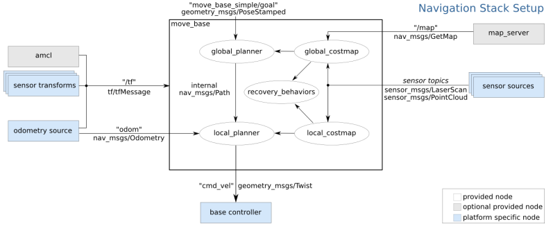

# **gopigo3 challenging projects**

The projects proposed will be based on:
- Gopigo3 navigation using python-based code
- Video and picture caption
- Image processing

References:
- https://learn.turtlebot.com/
- https://learn.turtlebot.com/2015/02/04/1/
- https://learn.turtlebot.com/2015/02/04/2/
- https://learn.turtlebot.com/2015/02/04/3/
- https://github.com/markwsilliman/turtlebot
- http://wiki.ros.org/Camera%2BDynamixelRobotSample/CameraPictureServer
- https://industrial-training-master.readthedocs.io/en/melodic/_source/session5/OpenCV-in-Python.html

The first step is to create a new package "gopigo3_projects" with dependencies:
- rospy
- sensor_msgs
- std_msgs
- cv_bridge

```shell
catkin_create_pkg gopigo3_projects rospy std_msgs sensor_msgs cv_bridge
```
This package is already created and ready to use it!

We will perform some specific projects related to gopigo3 vision capabilities in a navigation process.

## 1. Gopigo3 takes photo
The objective is to program a python code to take a photo using raspicam in gopigo3 robot prototype.

Important information is taken from: https://learn.turtlebot.com/2015/02/04/3/

Follow the procedure:
- Identify the topic name where raspicam publishes the photo as a mesage of type sensor_msgs:
```shell
roslaunch gopigo3_slam gopigo3_world.launch 
rostopic list
```
- Then modify the "take_photo.py" python file with:
    - the proper topic name /gopigo/camera1/image_raw
    - the proper photo filename in folder path: /media/sf_github_manelpuig/rUBot_gopigo_ws/Documentation/photos/photo1.jpg
- run the "take_photo.py" python file to take a photo
```shell
rosrun gopigo3_projects take_photo.py
```
- Open the "photos" folder and you will see the photo1.jpg created


## **2. Go to specific point in the map**

In this project we will learn how to send robot a command: “go to a specific position at map”.

The program is extracted from:
- https://github.com/markwsilliman/turtlebot
- https://learn.turtlebot.com/2015/02/03/11/

For this purpose we need to use the **move_base node**. This node:
- subscribes to move_base_simple/goal (geometry_msgs/PoseStamped)
- publishes to cmd_vel (geometry_msgs/Twist)



Follow the procedure:
- Launch Gazebo:
    ```shell
    roslaunch gopigo3_slam gopigo3_world.launch
    ```

- Launch the navigation:
    ```shell
    roslaunch gopigo3_slam gopigo3_navigation.launch
    ```
- Choose a target point in RVIZ using "Publish point" and select the target coordinates (i.e. x=2.0 y=-0.7)


- open "go_to_specific_point_on_map.py" and specify the target point
    - in line 78 specify the target point, customize the following values so they are appropriate for your location
        - position = {'x': 2.0, 'y' : -0.7}

- Launch the "go_to_specific_point_on_map.py" program:
    ```shell
    rosrun gopigo3_projects go_to_specific_point_on_map.py
    ```


## **3. Go to specific point in the map and take a photo**

We will combine our skills from two previous objectives: 
- “Going to a Specific Location on Your Map Using Code” 
- and “Taking a Photo Using Code”. 

The gopigo3 will go from the start to each goal from the list and take a photo in every position.

We will work with the files from: https://github.com/markwsilliman/turtlebot

Follow the instructions in: https://learn.turtlebot.com/2015/02/04/5/

We use the code go_to_specific_point_on_map.py and take_photo.py from previous exemples. 

We have generated  the python file **"Follow_the_route.py"** that reads input data from "route.yaml" file. 

The YAML file has three lines. It means that there are three goals. Look on the first line:

- {filename: 'dumpster.png', position: { x: 0.355, y: -0.2}, quaternion: {r1: 0, r2: 0, r3: -0.628, r4: 0.778}}

    The dumpster.png is the image title for picture. 
    
    The position and quaternion set the goal: the place where gopigo3 takes a photo. 

The objective is to follow the route and take pictures. 

Proceed with the following steps:

- Launch Gazebo:
    ```shell
    roslaunch gopigo3_slam gopigo3_world.launch
    ```

- Run the navigation demo:
    ```shell
    roslaunch gopigo3_slam gopigo3_navigation.launch
    ```

- Specify a "route.yaml" file with the points to follow and take photo:

    - {filename: './src/gopigo3_projects/photos/picture1.png', position: { x: -0.3, y: -0.8}, quaternion: {r1: 0, r2: 0, r3: -0.628, r4: 0.778}}
    - {filename: './src/gopigo3_projects/photos/picture2.png', position: { x: 1.7, y: -0.7}, quaternion: {r1: 0, r2: 0, r3: 0.936, r4: 0.353}}
    - {filename: './src/gopigo3_projects/photos/picture3.png', position: { x: 1.7, y: 0.5}, quaternion: {r1: 0, r2: 0, r3: 0.904, r4: -0.427}}

- Open a terminal in the ldestination of pictures and launch the "follow_the_route.py" program:
    ```shell
    rosrun gopigo3_projects follow_the_route.py
    ```

>Careful!: 
Be sure to execute the rosrun instruction inside the "rUBot_gopigo_ws" folder. Review the the absolute path or relative path to the yaml file and the picture path destination.


Improvement!:
- a modified "follow_the_route2.py" and "route2.yaml" is made in order to insert the target orientation in RPY degrees
    - {filename: './src/gopigo3_projects/photos/room11.png', position: { x: -0.3, y: -0.8}, angle: {fi: -90}}
    - {filename: './src/gopigo3_projects/photos/room22.png', position: { x: 1.7, y: -0.7}, angle: {fi: 0}}
    - {filename: './src/gopigo3_projects/photos/room33.png', position: { x: 1.7, y: 0.5}, angle: {fi: 0}}

Launch the "follow_the_route.py" program:

    rosrun gopigo3_projects follow_the_route2.py 