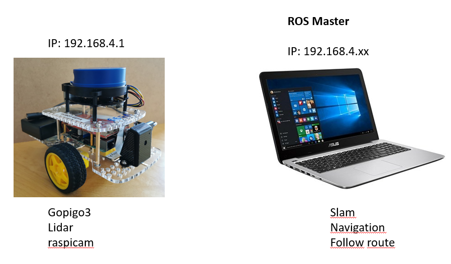
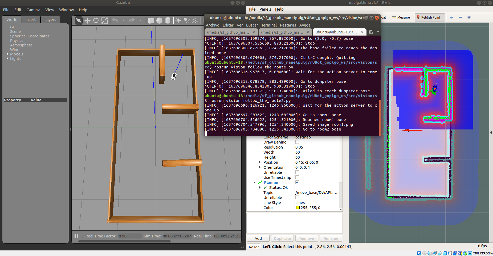

# **gopigo3 challenging projects in raspberrypi3**

The projects proposed will be based on Image processing and navigation
References:
- https://learn.turtlebot.com/
- https://learn.turtlebot.com/2015/02/04/1/
- https://learn.turtlebot.com/2015/02/04/2/
- https://learn.turtlebot.com/2015/02/04/3/
- https://github.com/markwsilliman/turtlebot
- http://wiki.ros.org/Camera%2BDynamixelRobotSample/CameraPictureServer
- https://industrial-training-master.readthedocs.io/en/melodic/_source/session5/OpenCV-in-Python.html


## **Hardware architecture**

To optimize the hardware/software capabilities, we will distribute the ROS nodes between raspberrypi3 and a PC.



- ROS Master will be located on the PC
- In Raspberrypi3 we will launch: gopigo3, lidar and raspicam
- In PC we will launch: slam, navigation and the other project nodes

First of all power on the gopigo3 and connect the PC to the RoboticsUB XX hotspot.

When different hardware have to communicate in a closed-loop within ROS, is needed:
1. Clock syncronisation has to be ensured. 
    - We have to install "chrony" in raspberrypi3 and PC. Open a new terminal and install it (you need internet connection)
    ```shell
    sudo apt-get install chrony
    ```
    > Connect the raspberrypi to the router using ethernet cable
    - define the configuration with the corresponding IP address
        - in PC (will be the Master-the Server):
            - open the file /etc/chrony/chrony.conf 
            ```shell
            sudo nano /etc/chrony/chrony.conf
            ```
            - add the lines:
            ```shell
            # Step the system clock instead of slewing it if the adjustment is larger than
            # one second, but only in the first three clock updates.
            makestep 1 3
            local stratum 8
            allow 192.168.4.1
            ```
            > to save and close the nano editor type ctrl+o and ctrl+x
            - init the chrony syncronization service:
            ```shell
            sudo /etc/init.d/chrony stop
            sudo /etc/init.d/chrony start
            ```
        - in Raspberrypi3 (will be the Client):
            - open the file /etc/chrony/chrony.conf and add the lines:
            ```shell
            # Step the system clock instead of slewing it if the adjustment is larger than
            # one second, but only in the first three clock updates.
            makestep 1 3
            server 192.168.4.16 minpoll 0 maxpoll 5 maxdelay .05
            ```
            > verify the IP address of the PC within the gopigo3 network. In my case is 192.168.4.16
            - init the chrony syncronization service:
            ```shell
            sudo /etc/init.d/chrony stop
            sudo /etc/init.d/chrony start
            ```

2. Source the new environment variables
    - In PC: open a new terminal and type (or add them to .bashrc file)
        ```shell
        export ROS_IP=192.168.4.16
        export ROS_MASTER_URI=http://192.168.4.16:11311
        ```
    - In raspberrypi3: open a new terminal and type (or add them to .bashrc file)
        ```shell
        export ROS_IP=192.168.4.1
        export ROS_MASTER_URI=http://192.168.4.16:11311
        ```

## **Launch ROS Master in PC**
First of all, copy the "gopigo3_projects" package we have prepared to the "rUBot_gopigo_ws" workspace in /src folder. Compile the workspace with catkin_make.

Now open a new terminal in workspace and lauch roscore:

```shell
roscore
```
## **Gopigo3 bringup in raspberrypi3**
To work in raspberrypi3 you can:
- use VNC
- open a terminal in windows and connect to rbpi3 using ssh
    ```slell
    ssh pi@192.168.4.1
    ```
You are now ready to launch the different nodes in raspberrypi3 (gopigo3, lidar and raspicam).
- Open a new terminal in raspberrypi3 and type:
    ```shell
    roslaunch gopigo_control gopigo3_bringup.launch
    ```
    > the argument "lidar_model" is "yd" by default. Change the launch file default value or specify the value typing:
    ```shell
    roslaunch gopigo_control gopigo3_bringup.launch lidar_model:=rp
    ```
    > The raspicam_node is not activated by default, if you want to activate it, modify the launch file

## **Projects execution in PC**
We will now start different nodes corresponding to the different projects we are planning for this section:
- Make a new map
- Take a photo
- Go to specific point in the map
- Go to specific point in the map and take a photo

## 1. Make a new map
Let's generate a new map, but now with this new architecture will be done significantly faster!

- We open a new terminal in PC to launch the slam:
    ```shell
    roslaunch gopigo3_slam gopigo3_slam_hw.launch
    ```
    > The launch file has by default the arguments lidar_model:=yd and model:=gopigo3
    >
    > You can change the default values in launch file or add them in the instruction:
    ```shell
    roslaunch gopigo3_slam gopigo3_slam_hw.launch lidar_model:=rp model:=gopigo3rp
    ```
- We open a new terminal in PC to launch the wall_follower node:
    ```shell
    roslaunch gopigo3_control node_hw_wall_follower_gm.launch
    ```
    > The launch file has by default the arguments lidar_model:=yd and model:=gopigo3
    >
    > You can change the default values in launch file or add the new arguments in the roslaunch instruction
- When the map generation is finished, we open a new terminal in PC and type in the destination map file location:
    ```shell
    rosrun map_server map_saver -f mimapa
    ```
- We can close all the processes in terminals

## 2. Take photo using Code:
The objective is to program a python code to take a photo using raspicam in gopigo3 robot prototype.

Follow the procedure:
- In raspberrypi3: We consider you have your gopigo3 launched including the raspicam node. Verify the gopigo3_bringup.launch file to have the raspicam node activated. If it is not activated, change it, close the process and type again:
    ```shell
    roslaunch gopigo_control gopigo3_bringup.launch
    ```
- Identify the topic name where raspicam publishes the photo as a mesage of type sensor_msgs. In a new terminal type:
    ```shell
    rostopic list
    ```
- Then modify the "take_photo.py" python file with:
    - the proper topic name
    - the proper photo filename in folder path: ./src/gopigo3_projects/photos/photo1.jpg
- run the "take_photo.py" python file to take a photo
    ```shell
    rosrun gopigo3_projects take_photo.py
    ```
- Open the "photos" folder and you will see the photo1.jpg created


## 3. Go to specific point in the map

In this project we will learn how to send robot a command: “go to a specific position at map”.

The program is extracted from:
- https://github.com/markwsilliman/turtlebot
- https://learn.turtlebot.com/2015/02/03/11/

Follow the procedure:
- Launch gopigo3_bringup in rbpi3 terminal: (If you have closed it)
    ```shell
    roslaunch gopigo3_control gopigo3_bringup.launch
    ```
- Launch the navigation using the previously generated map:
    ```shell
    roslaunch gopigo3_slam gopigo3_navigation_hw.launch
    ```
- Choose a target point in RVIZ using "Publish point" and select the target coordinates (i.e. x=2.0 y=-0.7)


- open "go_to_specific_point_on_map.py" and specify the target point
    - in line 78 specify the target point, customize the following values so they are appropriate for your location
        - position = {'x': 2.0, 'y' : -0.7}

- Launch the "go_to_specific_point_on_map.py" program:
    ```shell
    rosrun gopigo3_projects go_to_specific_point_on_map.py
    ```

## 4. Go to specific point in the map and take a photo

We will combine our skills from two previous objectives: 
- “Going to a Specific Location on Your Map Using Code” 
- and “Taking a Photo Using Code”. 

The gopigo3 will go from the start to each goal from the list and take a photo in every position.

We have generated  the python file "Follow_the_route2.py" that reads input data from route.yaml file. The YAML file has three lines. It means that there are three goals:

- {filename: './src/gopigo3_projects/photos/room11.png', position: { x: -0.3, y: -0.8}, angle: {fi: -90}}
- {filename: './src/gopigo3_projects/photos/room22.png', position: { x: 1.7, y: -0.7}, angle: {fi: 0}}
- {filename: './src/gopigo3_projects/photos/room33.png', position: { x: 1.7, y: 0.5}, angle: {fi: 0}}

The objective is to follow the route and take pictures. Proceed with the following steps:
- Launch gopigo3_bringup **in rbpi3 terminal**: (If you have closed it)
    ```shell
    roslaunch gopigo3_control gopigo3_bringup.launch
    ```
- Launch the navigation **in PC terminal**, using the previously generated map:
    ```shell
    roslaunch gopigo3_slam gopigo3_navigation_hw.launch
    ```

- Launch the "follow_the_route2.py" program **in PC terminal**, in the "rUBot_gopigo_ws" folder:
    ```shell
    rosrun gopigo3_projects follow_the_route2.py
    ```

>Careful!: 
Be sure to execute the rosrun instruction inside the "rUBot_gopigo_ws" folder. Review the the absolute path or relative path to the yaml file and the picture path destination.


