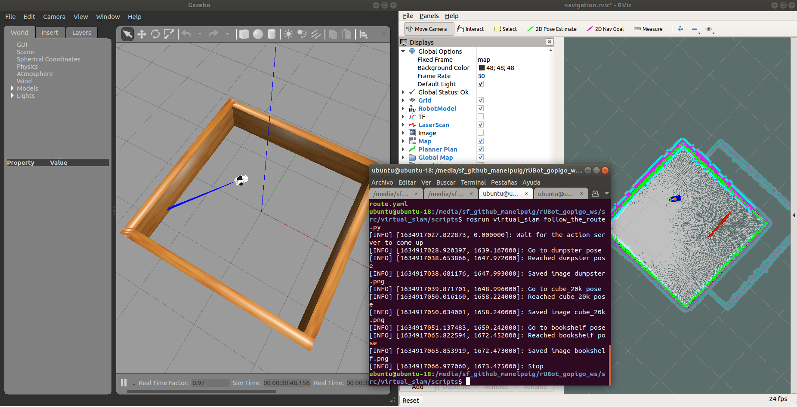

# **gopigo3 challenging projects in raspberrypi3**

The projects proposed will be based on:
1. Image processing
References:
- https://learn.turtlebot.com/
- https://learn.turtlebot.com/2015/02/04/1/
- https://learn.turtlebot.com/2015/02/04/2/
- https://learn.turtlebot.com/2015/02/04/3/
- https://github.com/markwsilliman/turtlebot
- http://wiki.ros.org/Camera%2BDynamixelRobotSample/CameraPictureServer
- https://industrial-training-master.readthedocs.io/en/melodic/_source/session5/OpenCV-in-Python.html

## 1. Take photo using Code:

https://learn.turtlebot.com/2015/02/04/3/

Modify the "take_photo.py" python file with:
- the proper topic name /gopigo/camera1/image_raw
- the proper photo folder path: /media/sf_github_manelpuig/rUBot_gopigo_ws/Documentation/photos/photo1.jpg
```shell
roslaunch rubot_control rubot_lidar_test.launch 
rostopic list
rosrun vision take_photo.py
```
## **2. Go to specific point in the map**

In this lesson we will learn how to send robot a command: “go to a specific position at map”.

We will work with the files from: https://github.com/markwsilliman/turtlebot

Follow the instructions in: https://learn.turtlebot.com/2015/02/03/11/

Launch Gazebo:
```shell
roslaunch virtual_slam gopigo3_world.launch
```

Run the navigation demo:
```shell
roslaunch virtual_slam gopigo3_navigation.launch
```
Choose a point: 

- select Publish point
- open "go_to_specific_point_on_map.py"
- in line 78 specify the target point, customize the following values so they are appropriate for your location
    - position = {'x': 1, 'y' : 0}

Launch the "go_to_specific_point_on_map.py" program:
```shell
rosrun vision go_to_specific_point_on_map.py
```

>Carefull!!:
- if the python program is not working, be sure to make "source devel/setup.bash"

## **3. Go to specific point in the map and take a photo**

We will combine our skills from two previous objectives: “Going to a Specific Location on Your Map Using Code” and “Taking a Photo Using Code”. The gopigo3 will go from the start to each goal from the list and take a photo in every position.

We will work with the files from: https://github.com/markwsilliman/turtlebot

Follow the instructions in: https://learn.turtlebot.com/2015/02/04/5/

We use the code go_to_specific_point_on_map.py and take_photo.py from previous exemples. 

Follow_the_route.py reads input data from route.yaml file. The YAML file has three lines. It means that there are three goals. Look on the first line:

- {filename: 'dumpster.png', position: { x: 0.355, y: -0.2}, quaternion: {r1: 0, r2: 0, r3: -0.628, r4: 0.778}}

The dumpster.png is the image title for picture. The position and quaternion set the goal: the place where TurtleBot takes a photo. 

Launch Gazebo:

    roslaunch virtual_slam gopigo3_world.launch

Run the navigation demo:

    roslaunch virtual_slam gopigo3_navigation.launch

Specify a yaml file with the points to follow and take photo:

- {filename: 'dumpster.png', position: { x: 0.355, y: -0.2}, quaternion: {r1: 0, r2: 0, r3: -0.628, r4: 0.778}}
- {filename: 'cube_20k.png', position: { x: 2.843, y: -1.743}, quaternion: {r1: 0, r2: 0, r3: 0.936, r4: 0.353}}
- {filename: 'bookshelf.png', position: { x: 1.401, y: 2.913}, quaternion: {r1: 0, r2: 0, r3: 0.904, r4: -0.427}}

Launch the "follow_the_route.py" program:

    rosrun vision follow_the_route.py 

>Careful!: 
Be sure to execute the rosrun instruction inside the folder where your yaml file is located, or specify the absolute pathe or relative path to the yaml file.



Improvement!:
- a modified "follow_the_route2.py" and "route2.yaml" is made in order to insert the target orientation in RPY degrees

Launch the "follow_the_route.py" program:

    rosrun vision follow_the_route2.py 